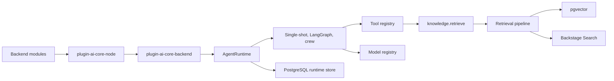

# AI Crew Suite

AI Crew Suite is a Backstage plugin workspace for building retrieval-augmented, tool-using AI agents inside a developer portal. It began as a fork of the Roadie RAG AI plugins, but the architecture has been reshaped from a single assistant that answers one retrieval-backed question into a core platform for agents, crews, provider modules, runtime persistence, and structured execution streams.

The original Roadie implementation gave us the useful foundation: catalog and TechDocs ingestion, vector embeddings, a retrieval pipeline, pgvector storage, and a chat-style SSE response path. AI Crew Suite keeps that retrieval quality and makes it one capability inside a broader runtime. Retrieval is now exposed as the `knowledge.retrieve` tool, while agents can also use registered models, tools, sources, triggers, memory, approvals, artifacts, and orchestration strategies.

## What Changed From The Original RAG Plugins

Roadie's plugins were centered on one flow: ask a question, retrieve relevant Backstage context, build one prompt, stream one model response. That is still a valid use case, but it is not enough for workflows such as incident response, documentation review, cost analysis, release-note generation, PR review, drift detection, or remediation agents.

AI Crew Suite adds the missing runtime layers:

- **Agent registry**: Multiple agents can coexist in one backend, each with its own model, prompt, tools, memory mode, and orchestrator.
- **Tool registry**: Retrieval, GitHub/Jira-like integrations, operational actions, and future tool packs can be registered behind a shared `Tool` contract.
- **Model registry**: Provider modules contribute LangChain models by stable IDs, and agents reference those IDs through `modelRef`.
- **Source registry**: Retrieval sources are open-ended strings rather than a closed catalog/TechDocs-only enum.
- **Structured orchestration**: Runs emit normalized `step`, `token`, `tool_call`, `tool_result`, `approval_request`, `artifact`, `usage`, `done`, and `error` events.
- **Stateful execution**: Sessions, run steps, checkpoints, approvals, artifacts, and audit logs are persisted in PostgreSQL alongside pgvector embeddings.
- **Human-in-the-loop controls**: Write-capable actions can pause for approval and resume with an auditable decision.
- **Backstage module system**: Provider packages register through Backstage backend extension points instead of legacy set-once wiring.

The result is an agent platform where RAG is still first-class, but no longer the whole system.

## Architecture At A Glance



The important design rule is that core packages communicate through contracts, not provider-specific implementation details. The runtime does not know whether a model came from OpenRouter, whether embeddings came from OpenAI or Bedrock, or whether a future tool talks to GitHub, Jira, Kubernetes, or Scaffolder. Those details belong in modules.

## Core Package Map

| Package                                                               | Purpose                                                                                                                                              |
| --------------------------------------------------------------------- | ---------------------------------------------------------------------------------------------------------------------------------------------------- |
| `@webstackbuilders/plugin-ai-core-node`                               | Shared contracts and Backstage extension points for sources, tools, models, agents, triggers, orchestrators, vector stores, and runtime persistence. |
| `@webstackbuilders/plugin-ai-core-backend`                            | Runtime backend plugin that assembles registries, validates wiring, creates the controller, runs orchestrators, and exposes HTTP/SSE routes.         |
| `@webstackbuilders/plugin-ai-core-backend-module-retrieval-augmenter` | Default catalog/TechDocs indexing, vector retrieval, Backstage Search retrieval, source routing, and retrieval post-processing.                      |
| `@webstackbuilders/plugin-ai-core-backend-module-pgvector`            | PostgreSQL pgvector storage plus runtime persistence for sessions, runs, checkpoints, approvals, artifacts, and audit logs.                          |
| `@webstackbuilders/plugin-ai-core-backend-module-aws`                 | AWS Bedrock embeddings module that contributes an embeddings-backed retrieval/indexing tool.                                                         |
| `@webstackbuilders/plugin-ai-core-backend-module-openai`              | OpenAI embeddings module that contributes an embeddings-backed retrieval/indexing tool.                                                              |
| `@webstackbuilders/plugin-ai-core-backend-module-openrouter`          | OpenRouter model provider module that contributes LangChain chat models to the model registry.                                                       |
| `@webstackbuilders/plugin-ai-crew-suite`                              | Frontend plugin surface for interacting with AI Crew Suite capabilities in Backstage.                                                                |

See [docs/core-development/index.md](docs/core-development/index.md) for the deeper core development documentation.

## Getting Started

This repository is a Backstage monorepo using Yarn 4 Plug'n'Play, Turbo, TypeScript project references, and package-local plugin builds.

Prerequisites:

- Node.js `>=22.22.2`
- Yarn `4.17.1`, as declared by `packageManager`

Install dependencies from the project root:

```bash
yarn install --refresh
```

Run the Backstage app and backend in development mode:

```bash
yarn dev
```

Run the standard quality gates:

```bash
yarn lint
yarn typecheck:full
yarn test
```

Build the workspace:

```bash
yarn build
```

## Repository Layout

```text
packages/
  app/       Backstage frontend app shell
  backend/   Backstage backend app shell
plugins/
  backend/   AI Core backend plugin and provider modules
  frontend/  AI Crew Suite frontend plugin
docs/
  core-development/  Architecture and maintainer docs for the core AI plugins
```

The backend plugins are the center of the current refactor. Most implementation work lives under [plugins/backend](plugins/backend), while the generated architecture docs live under [docs/core-development](docs/core-development).

## Development Workflow

Run package-specific commands from the monorepo root so Yarn PnP and workspace references resolve correctly. For example:

```bash
yarn workspace @webstackbuilders/plugin-ai-core-backend test
yarn workspace @webstackbuilders/plugin-ai-core-backend-module-openrouter build
yarn tsc -b plugins/frontend/plugin-ai-crew-suite/tsconfig.json --noEmit
```

When adding or changing a core backend module, update the matching package README and the relevant page under [docs/core-development](docs/core-development). The core docs are organized by operational layer:

- [Core Development](docs/core-development/index.md)
- [Orchestrators & Agents](docs/core-development/orchestrators.md)
- [Runtime API & Operations](docs/core-development/runtime-api.md)
- [Ingestion Pipelines](docs/core-development/ingestion-pipelines.md)
- [LLM Providers](docs/core-development/llm-providers.md)
- [Embeddings & Vector Stores](docs/core-development/embeddings-vectorstores.md)

## Design Principles

The refactor is guided by a few practical decisions:

- **No legacy contract preservation**: These plugins are built for this workspace, so stale Roadie routes and singleton assumptions can be removed when they block the new architecture.
- **Registries over setters**: Sources, tools, models, agents, and triggers are additive registries keyed by stable IDs.
- **Retrieval as a tool**: The RAG pipeline is preserved and exposed as `knowledge.retrieve`, which lets every orchestrator use it without owning retrieval details.
- **Provider modules stay narrow**: Model providers register models; embeddings providers register retrieval/indexing tools; storage modules implement persistence contracts.
- **Structured streams first**: UI and runtime behavior should consume typed agent events, not provider-specific text chunks.
- **Persistence and auditability by default**: Runs, steps, approvals, artifacts, token usage, and write actions should be inspectable after execution.

## Documentation Notes

The underscore-prefixed files in [docs/core-development](docs/core-development) are historical refactor notes and planning material. They document the thinking behind the Roadie RAG migration, chunking decisions, testing strategy, and package modernization, but they are not intended to be permanent published docs.

Maintainer-facing docs that should stay current are the non-underscore files in [docs/core-development](docs/core-development) and the package READMEs under [plugins/backend](plugins/backend).

## License

Copyright 2026 Webstack Builders, Inc. Licensed under the [Apache License, Version 2.0](http://www.apache.org/licenses/LICENSE-2.0)
