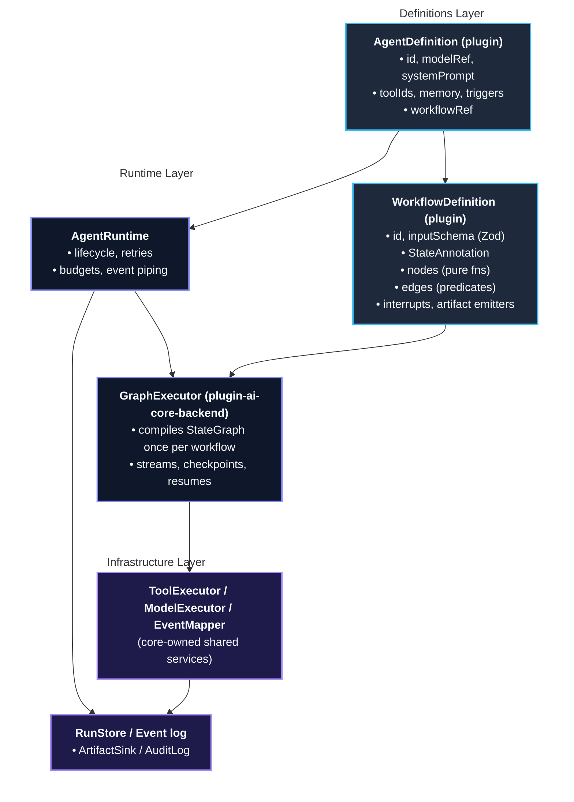

# AI Core Refactor — LangGraph-Native Execution Infrastructure

**Status**: Plan. Greenfield rebuild — no backward compatibility, no incremental shims. The repo is dev-only with a single developer; we break it and rebuild it correctly.

**Scope**: `plugin-ai-core-node`, `plugin-ai-core-backend`, and the 18 `plugin-ai-agent-backend-*` workflow plugins. Module plugins (`plugin-ai-core-backend-module-*`) keep their driver/tool contracts; only cloud-providers' tool registration (LangChain-shaped tools) is normalized as part of this work.

## 1. Problem Statement

The fork-era orchestrators (`SingleShotOrchestrator`, `LangGraphOrchestrator`, `CrewOrchestrator`) are thin retrieval-and-chat loops incapable of hosting real agentic workflows: no allow-listed tool execution, no branching, no mid-graph checkpoint/resume, no real approval gates. `LangGraphOrchestrator` has never used the LangGraph library — the name is a false promise.

The 18 workflow plugins therefore each hand-rolled the same execution substrate: a bespoke `*ToolRunner` (allow-list checks, budgets, timeouts, limitation tracking), imperative step sequencing, ad-hoc state threading, and per-plugin checkpoint/resume plumbing. The shared executor layer that the kubernetes-ai-responder plan assigned to core (`ToolExecutor`, `ModelExecutor`, event sink, artifact writer) was never built. Result: 18 copies of infrastructure, divergent safety behavior, and zero usage of the orchestration machinery that exists.

## 2. Target Architecture

One execution engine, built on `@langchain/langgraph`, living in `plugin-ai-core-backend`, executing **declarative workflow definitions** owned by plugins and contributed through the existing `workflowRunnerExtensionPoint`.



**Layering rule (the original vision, now enforced by types):**

- Core owns *how* any node safely invokes a tool or model, how state is checkpointed, how runs are interrupted for approval, and how every step becomes an auditable, replayable event.
- Plugins own *why*:
  - **Node Functions:** Deterministic domain logic.
  - **Edge Predicates:** Returns the __string ID of the next node, or `END`__ (a `route` function) that determines which path the workflow should take next.
  - **State Schema**
  - **Tool Selection per Node**
  - **Prompt Construction**
  - **Report Schemas**
  - **Citation Rules**

Plugins never directly touch:

- `ToolRegistry`
- Model Maps: *see `_CORE_REFACTOR_LLM_EXTENSIONS.md` for issues*
- Stores
- SSE: Server-Sent Events from an AI backend server.

## 3. Dependency and Version Policy

- Add `@langchain/langgraph` (pin `^1.4.13`) to `plugin-ai-core-node` (types only) and `plugin-ai-core-backend` (runtime). Align `@langchain/core` to a single version across all packages (pin `^1.2.9`, enforce via a root `resolutions` entry and a lint rule so this class of drift cannot recur).
- `@langchain/langgraph` is **not** a plugin-facing dependency: plugin packages receive workflow-definition helpers from core-node and never import `@langchain/langgraph` directly. This keeps the engine swappable and prevents 18 divergent LangGraph versions/patterns.
- Remove dead code: `LlmService` prompt-string assembly (replaced by chat-model message arrays), the three orchestrator classes, and their tests.

## 4. `plugin-ai-core-node` — New Contract Surface

All new types live under `src/workflow/` (new directory). The old `Orchestrator` interface and the `orchestrator`/`crew` fields on `AgentDefinition` are **deleted**.

### 4.1 Workflow definition DSL

```ts
/**
 * Zod-validated single-source-of-truth memory for a single
 * execution of the graph. Each key maps to a reducer.
 */
export type WorkflowStateSchema<TState> = {
  /**
   * Zod object schema; validated at every checkpoint
   * boundary. Ensures that no node accidentally injects
   * malformed data into the graph's memory.
   */
  schema: ZodType<TState>;
  /**
   * Per-channel reducers; default is last-write-wins. This
   * is how LangGraph handles state updates when a node
   * returns data. Instead of overwriting everything, a
   * reducer defines the merging behavior for a specific
   * key.
   */
  reducers?: { [K in keyof TState]?: (prev: TState[K], next: TState[K]) => TState[K] };
  /**
   * A schema migration guard. If a long-running agent
   * workflow is paused for human approval and the plugin
   * code is updated in the meantime, this prevents a
   * breaking type error. The executor will refuse to resume
   * the run if the checkpointed state version doesn't match
   * the new version.
   */
  stateVersion: number;
};

/**
 * Nodes are the "workers" of the graph. Each key is a
 * unique string identifier (e.g., "fetchCode",
 * "generateTests"), and the value is a pure-ish async
 * function.
 */
export type WorkflowNodeInput<TState, TInput> = {
  /** The current snapshot of the global workflow state. */
  state: TState;
  /**
   * The initial parameters passed to the workflow as input
   * when it started, Zod validated by inputSchema.
   */
  input: TInput;
    /**
     * The execution context injected by the Core layer.
     * Holds infrastructure primitives the plugin shouldn't
     * manage directly like logging utilities, tracing
     * spans, or the scoped backend HTTP clients.
     */
  ctx: NodeExecutionContext;
};

/**
 * A node is a pure-ish async function. Nodes do not
 * overwrite state directly. They return a patch (a partial
 * object). The Core executor passes this patch through
 * reducers to update the global state.
 */
export type WorkflowNode<TState, TInput> = (
  node: WorkflowNodeInput<TState, TInput>
) => Promise<Partial<TState>>;

/**
 * Edges define the control flow (the wires connecting
 * the nodes).
 */
export type WorkflowEdge<TState> =
  /**
   * A static edge that is a hardcoded transition.
   * When node A finishes, always execute node B next.
   */
  | { from: string; to: string }                             
  /**
   * LangGraph's Conditional Edge. The edge predicate reads
   * the current state and returns the string ID of the next
   * node to run, or a special END token to terminate the
   * workflow.
   */
  | { from: string; route: (
       state: TState
     ) => string | typeof END };

/**
 * Handles Human-in-the-Loop (HITL) interactions. LangGraph
 * implements this via state checkpointing and pausing
 * execution before or after specific nodes.
 */
export type WorkflowInterrupt<TState> = {
  /**
   * Tells the Core executor to halt execution and save a
   * checkpoint right before this node runs.
   */
  beforeNode: string;
  /**
   * A pure mapping function. When the workflow hits the
   * interrupt, it freezes. This function takes the frozen
   * state and extracts a clean payload describing why it is
   * paused (e.g. { reason: "Deploying to production
   * requires approval", effect: "write" }) so the Backstage
   * frontend can render an approval UI.
   */
  approvalRequest: (state: TState) => {
      reason: string;
      effect: 'write'
  };
  /**
   * Once a human interacts with the Backstage UI and
   * submits an ApprovalDecision (e.g., Approved/Denied),
   * this function takes that decision and maps it back into
   * a state patch (e.g., updating a status: "approved"
   * key), allowing the Core executor to safely resume.
   */
  applyDecision: (
    state: TState, decision: ApprovalDecision
  ) => Partial<TState>;
};

/** Root definition keys */
export type WorkflowDefinition<
  TState = unknown, TInput = unknown
> = {
  /**
   * A unique string identifying this exact workflow   
   * config. Referenced by `AgentDefinition.workflowRef`.
   * Entity models use this ID to instantiate new agent
   * runs.
   */
  id: string;
  /**
   * A Zod schema validating the payload a user sends when
   * they first trigger the workflow from Backstage (e.g.,
   * target repository, organization, or branch names).
   * Replaces BaseGraphRunner.
   */
  inputSchema: ZodType<TInput>;
  state: WorkflowStateSchema<TState>;
  /** Specifies the starting node where execution begins
   * when the graph is brand new.
   */
  entryNode: string;
  nodes: Record<string, WorkflowNode<TState, TInput>>;
  edges: WorkflowEdge<TState>[];
  interrupts?: WorkflowInterrupt<TState>[];
  /**
   * A safety allowlist of output types this specific
   * workflow is allowed to generate (e.g.['pull_request']).
   * The Core layer intercepts outputs and checks them
   * against this list to ensure plugins don't emit
   * unapproved or untracked data types.
   */
  artifactKinds: readonly string[];
};
```

Key properties of this design:

- **Determinism is structural.** Edges are TypeScript predicates evaluated by the executor. A node cannot influence routing except by writing state through typed channels. This preserves the suite's core safety invariant (thresholds, verdicts, patches computed in pure code) by construction.
- **Interrupts are declarative.** A workflow lists its approval gates; the executor owns the pause/checkpoint/resume mechanics. Per-plugin `resume()` implementations disappear.
- **Parallelism is free.** Multiple static edges from one node compile to LangGraph parallel branches; rfc-adr / scaffolder-prd fan-out stops being hand-rolled `Promise.all`.

### 4.2 `AgentDefinition` changes

```diff
 export type AgentDefinition = {
   id: string;
   modelRef: string;
   workflowRef?: string;
   systemPrompt: string;
   toolIds: string[];
-  orchestrator?: 'single-shot' | 'langgraph' | 'crew';
   memory?: 'none' | 'session';
-  crew?: { roles: [...] };
   triggers?: TriggerBinding[];
 };
```

- `workflowRef` becomes **required**. Instead of letting a broken or misconfigured agent pass silently through compilation only to crash in production when a user triggers it, the system will now parse all `AgentDefinition` configurations when the Backstage backend boots up. If an agent points to a missing workflow, or lacks a `workflowRef` entirely, the server will **refuse to start**. There is no orchestrator fallback. An agent without a workflow is a boot-time error. This eliminates the placeholder agents and the entire default-agent fallback chain (see section 6.4).

### 4.3 `AgentEvent` v2

Establishes **strict per-node structural attribution** across the entire Server-Sent Events (SSE) streaming infrastructure. By forcing almost every event to explicitly state which `node` it originated from, the system avoids losing execution context during real-time streaming.

The event union is rebuilt once, correctly, with per-node attribution throughout:

```ts
export type AgentEvent =
    /**
     * Lifecycle & Navigation Event: Marks the exact
     * boundary of a node's execution lifecycle. It fires an
     * enter phase when the Core engine schedules and begins
     * executing a specific node, and an exit phase the
     * moment that node successfully finishes and writes its
     * state patch. The frontend uses this to manage
     * active/loading visual states.
     */
  | { type: 'step';
      data: {
          runId: string;
          /**
           * A monotonically increasing integer counter that
           * tracks the exact chronological order of steps
           * executed during a single run. Server-Sent
           * Events (SSE) streams can arrive with events
           * out of order.
           */
          seq: number;
          node: string;
          phase: 'enter' | 'exit'
      }
    }
    /**
     * LLM Interactivity Event: Streams the raw, incremental
     * text output (chunks) directly from the underlying
     * language model as it is being generated. Because node
     * is required, every character chunk is bound to its
     * source step.
     */
  | { type: 'token';
      data: {
          runId: string;
          node: string; // 'node' now required
          text: string
      }
    }
    /**
     * Tool Execution Event: Fires when the execution engine
     * dispatches a tool invocation on behalf of a node.
     *
     * The decision to invoke a tool takes exactly two
     * forms:
     *
     * **Deterministic:** the node's own code calls
     * `ctx.tools.invoke(...)` (e.g., calling a tool to
     * query GitHub or spin up a Scaffolder template). The
     * model is not involved in the decision.
     *
     * **Model-proposed** (LLM-orchestrated workflows only):
     * the model emits `tool_calls` in its output, which the
     * engine captures as a `PendingToolCalls` state patch
     * and routes through the core-provided
     * execute_tool_calls` node. The model proposes; it
     * never executes.
     *
     * In both cases the engine's `ToolExecutor` performs
     * the actual invocation after enforcing the agent's
     * tool allow-list, per-tool timeouts, invocation
     * budgets, and approval policy for write-effect tools.
     * A `tool_call` event therefore always represents an
     * authorized, bounded, audited invocation — never raw
     * model output.
     *
     * The event includes the tool's name and arguments
     * (redacted). It allows the frontend to explicitly show
     * that an agent is actively performing an engineering
     * task rather than just "thinking".
     */
  | { type: 'tool_call';
      data: {
          runId: string;
          node: string;
          tool: string;
          args: unknown
      }
    }
    /**
     * Tool Execution Event: Emitted as soon as the invoked
     * tool completes. Provides auditability. If a tool
     * fails (ok: false), the UI can render exact diagnostic
     * feedback for that specific tool inside the parent
     * node's layout.
     */
  | { type: 'tool_result';
      data: {
          runId: string;
          node: string;
          tool: string;
          ok: boolean;
          summary?: string;
          output?: unknown
      }
    }
    /**
     * Analytics & Guardrails Event: Emits LLM token metrics
     * (input, output, total). If node is provided, it
     * profiles that specific node's execution cost. If node
     * is omitted, it serves as the final macro financial
     * summary for the entire run. Feeds infrastructure
     * logging to track platform spend, token consumption,
     * and prompt efficiency across the engineering
     * organization.
     */
  | { type: 'usage';
      data: {
          runId: string;
          node?: string;
          input: number;
          output: number;
          total: number
      }
    }
    /**
     * Human-in-the-Loop Control Event: Triggers when the
     * execution engine encounters a WorkflowInterrupt gate
     * when the graph parks at an interrupt. It pauses the
     * thread and provides an approvalId, along with the
     * structural rationale for the block. Transitions the
     * Backstage frontend component into an interactive user
     * prompt state, rendering "Approve" or "Deny" action
     * buttons for the engineer. Emitted by the executor,
     * not by the node.
     */
  | { type: 'approval_request';
      data: {
          runId: string;
          approvalId: string;
          node: string;
          reason: string;
          effect: 'write'
      }
    }
    /**
     * System Control Event: Signals that a node has
     * generated a permanent, structured platform output
     * (e.g., creating a new repository URL or emitting an
     * automated pull request reference). The Core layer 
     * uses this to validate emissions against
     * `artifactKinds`, and the frontend treats these as the
     * primary "deliverables" of the workflow to highlight
     * them in a dedicated summary card.
     */
  | { type: 'artifact';
      data: {
          runId: string;
          kind: string;
          url?: string;
          ref?: string
      }
    }
    /**
     * Lifecycle & Navigation Event: Signifies that the
     * entire LangGraph execution has successfully reached
     * the END token and terminated. It includes the runId
     * and optionally carries a long-lived sessionId to bind
     * this run history to a user session. It tells the
     * frontend streaming client to safely close the Server-
     * Sent Events (SSE) connection and cease listening for
     * updates.
     */
  | { type: 'done';
      data: {
          runId: string;
          sessionId?: string
      }
    }
    /**
     * Lifecycle & Navigation Event: 
     */
  | { type: 'error';
      data: {
          runId: string;
          node?: string;
          code: ErrorCode;
          retryable: boolean;
          message: string
      }
    };

export type ErrorCode =
  | 'invalid_input'
  | 'tool_failed'
  | 'tool_denied'
  | 'model_failed'
  | 'budget_exceeded'
  | 'cancelled'
  | 'timeout'
  | 'state_validation'
  | 'interrupted'
  | 'unknown';
```

Frontend plugins update their reducers once against the v2 union (all 18 already share the same SSE client shape — one mechanical pass).

#### 4.3.1 Benefit: Enables Granular Audit Logs & Timeline Visualizations

Because every lifecycle hook (`step`, `tool_call`, `tool_result`, `approval_request`) requires a `node` field, the Core engine can stitch these flat events into a highly detailed, chronological timeline UI.

A frontend developer can build a single, universal reducer that maps this union into a UI tree:

```
└── Node: "generate_tests"
    ├── phase: 'enter'
    ├── token: "Thinking..."
    ├── tool_call: "read_file" -> tool_result: "ok"
    └── phase: 'exit'
```

#### 4.3.2 Benefit: Provides Per-Node Token Usage Accounting

The `usage` event tracks LLM token metrics (`input`, `output`, `total`). Making `node` an optional field here (`node?: string`) allows the system to emit two levels of financial/resource metrics:

- **Attributed usage (`node: "review_code"`):** Exactly how much it cost to run a specific node. Excellent for profiling your workflow graphs to find which prompts are wasting money.
- **Global usage (`node: undefined`):** The aggregate token consumption for the entire run lifecycle when the graph hits the `done` state.

#### 4.3.3 Benefit: Categorized, Actionable Error Boundaries (`ErrorCode`)

Instead of emitting generic strings, errors are strongly typed. This allows the Core framework and the Frontend to coordinate exact recovery behaviors based on the `code` and `retryable` properties:

| Error Code | Meaning / Architectural Context | Expected UI or Core Action |
| --- | --- | --- |
| `state_validation` | The node output failed the Zod check against `state.schema` | Hard stop; requires developer code fix. |
| `tool_denied` | A tool required permission or failed an approval check | Show a "Permission Denied" warning state. |
| `budget_exceeded` | The graph crossed a threshold in token or infrastructure cost | Core halts the run; UI reports resource exhaustion. |
| `interrupted` | The workflow hit a defined `WorkflowInterrupt` gate | Shift UI into an active, blocked approval prompt state. |

### 4.4 Store contract upgrades

`CheckpointStore` (`save`/`load` of an opaque blob) is insufficient for LangGraph resume semantics. Replace it:

```ts
export interface CheckpointStore {
  /**
   * Persists a checkpoint at a graph position. Append-only;
   * never overwritten.
   */
  put(record: CheckpointRecord): Promise<void>;
  /** Latest checkpoint for a run. */
  getLatest(runId: string): Promise<
    | CheckpointRecord
    | undefined
  >;
  /** Full ordered history for replay/debug. */
  list(runId: string): Promise<CheckpointRecord[]>;
  /**
   * Tombstone (soft delete) a run's checkpoints after
   * terminal state + retention.
   */
  delete(runId: string): Promise<void>;
}

export type CheckpointRecord = {
  runId: string;
  /** Monotonic checkpoint number within the run. */
  seq: number;
  /**
   * Graph node the graph will enter next (absent = 
   * complete).
   */
  nextNode?: string;
  /** Zod-validated, versioned workflow state snapshot. */
  state: unknown;
  stateVersion: number;
  /**
   * Pending interrupt payload when the graph is paused for
   * approval.
   */
  pendingApproval?: {
      approvalId: string;
      node: string;
      reason: string
  };
  createdAt: string;
};
```

The executor maps this onto LangGraph's `BaseCheckpointSaver` via a thin internal adapter (`plugin-ai-core-backend/src/runtime/LangGraphCheckpointer.ts`). The storage module (`plugin-ai-core-backend-module-runtime-store`) gains a `checkpoints` table with `(runId, seq)` primary key — a real schema, not a blob bucket. `put` is idempotent on `(runId, seq)` so executor retries cannot double-write.


## 5. `plugin-ai-core-backend` — The Execution Engine

### 5.1 `GraphExecutor` (the single engine)

`src/runtime/GraphExecutor.ts`

At boot:

1. `compileWorkflow(def)`: build a `StateGraph` from `def.state` (Annotation channels from the Zod schema + reducers), add nodes wrapped in the node harness (5.2), wire edges, attach interrupts as LangGraph `interruptBefore` boundaries, compile with the `LangGraphCheckpointer` (`thread_id` = `runId`).
2. Static validation (fail boot, not first run): unknown edge endpoints, unreachable nodes, interrupt on missing node, artifact-kind mismatch, missing input schema, missing `stateVersion`. Plus the existing agent-level validation in `factory.ts` (unknown model / tool / workflowRef), minus the crew / orchestrator branches.

At run time:

1. Validate input against `inputSchema` (this absorbs `BaseGraphRunner`'s job; `BaseGraphRunner` is deleted).
2. `graph.stream(input, { streamMode: ['updates', 'messages', 'custom'] })`, mapped to `AgentEvent` v2 via `EventMapper` (5.4).
3. On interrupt: persist checkpoint with `pendingApproval`, emit `approval_request`, end the stream cleanly with run status `paused`.
4. Resume: controller loads latest checkpoint, verifies `pendingApproval.approvalId` matches the submitted decision, runs `applyDecision`, and calls `graph.stream(Command({ resume: ... }))` from the checkpoint.

### 5.2 Node harness — where the safety lives

Every plugin node function executes inside a core wrapper that enforces, per invocation:

- **State validation**: Zod-parse the state patch returned by the node; reject unknown keys; apply reducers. A node returning malformed state produces a `state_validation` error event, never a corrupted checkpoint.
- **Budget accounting**: wall-clock per node, cumulative token budget, cumulative tool-invocation count; exceeding any emits `budget_exceeded` and aborts the run via LangGraph cancellation, not a thrown string.
- **Redaction**: the existing `SENSITIVE_KEYS` redactor moves from `AgentRuntime` into the harness and applies to state patches, tool args/results in events, and checkpoint payloads. Secrets must never enter graph state: channels hold *references* (artifact refs, evidence IDs), and the harness rejects checkpoint payloads containing credential-shaped strings (regex sweep as defense-in-depth, tested).
- **Structured errors**: node exceptions are caught, classified into `ErrorCode` + `retryable`, surfaced as `error` events with the node name attached. Run-level retry policy (`maxRetries`, exponential backoff — already in `AgentRuntime`) stays; nodes signal retryable failures by throwing a `RetryableNodeError` type exported from core-node.

### 5.3 `NodeExecutionContext` — the plugin-facing API

Replaces both `WorkflowContext.invokeTool` and the 18 hand-rolled `*ToolRunner` classes:

```ts
export type NodeExecutionContext = {
  /** Run-scoped logger; all lines carry runId + node. */
  logger: LoggerService;
  /**
   * The only path to tools. Enforces allow-list, budgets,
   * timeouts, identity, audit, events.
   */
  tools: ToolExecutor;
  /**
   * The only path to models. Streams tokens as events;
   * enforces token budgets.
   */
  model: ModelExecutor;
  /**
   * Emit a typed artifact event + persist to ArtifactSink.
   * Kind must be declared on the workflow.
   */
  emitArtifact(
    kind: string,
     payload: {
        ref?: string;
        url?: string
    }): Promise<void>;
  /**
   * Deterministic clock (injectable; defaults to Date).
   * Tests freeze it.
   */
  now(): Date;
  /**
   * Abort signal honoring run cancellation and per-node
   * timeouts.
   */
  signal: AbortSignal;
};
```


`ToolExecutor` (new, core-owned, `src/runtime/ToolExecutor.ts`):

1. Allow-list check against `agent.toolIds` — violation is a `tool_denied` error event, audited.
2. **Effect gating**: invoking a tool with `effect: 'write'` outside an approved interrupt window throws `tool_denied`. Write tools may only execute in a node whose `interruptBefore` gate has been approved in *this* run. This makes the approval policy structural instead of heuristic (the old `LangGraphOrchestrator` regex hack is explicitly deleted).
3. Timeout, retry classification, invocation budget, identity/credentials propagation, `AbortSignal` wiring.
4. Emits `tool_call` / `tool_result` events with redacted args and compact summaries; records audit entries for writes.

`ModelExecutor` (replaces `LlmService`):

- Resolves the agent's `modelRef` from the model registry; supports `BaseChatModel` only (message arrays, `.bindTools()` support). **Legacy `BaseLLM` support is removed** — see `module-models-chat` in §5.6 below.
- Streams via LangChain callbacks so token events carry node attribution and `usage_metadata` accumulates into per-node and per-run usage events.
- **Tool-calling support**: `model.stream({ messages, tools?: ToolSpec[] })` where `tools` are the agent's allow-listed read tools expressed as JSON-schema tool specs. When the model emits `tool_calls`, the executor does **not** auto-dispatch: it yields a typed `PendingToolCalls` state patch, and the workflow's own edge predicate routes to a generic core-provided `execute_tool_calls` node (registered by the executor, not the plugin) which dispatches through `ToolExecutor`. This gives LLM-orchestrated workflows (ROADMAP item 2) a safe, allow-listed, budgeted path — the model proposes, the engine disposes, write tools still interrupt.
- Prompt assembly moves to message arrays (`SystemMessage`/`HumanMessage`); the `Human:\n...\nAssistant:` string-concat in `LlmService` is deleted.

### 5.4 `EventMapper`

One module (`src/runtime/EventMapper.ts`) translating LangGraph stream events to `AgentEvent` v2: node enter / exit from `updates`, tokens from `messages` (with node attribution), custom events from `custom`. Single ownership means event-shape bugs are fixed once, for every plugin.


### 5.5 Model Capability Categories (replaces `modelExtensionPoint`)

The fork-era `modelExtensionPoint` accepts a single `BaseLLM | BaseChatModel` union and collapses **all** model types into one map. That structure is deleted and replaced by per-category core modules, each following the capability-category pattern (registry + extension point + config resolution + tool factory — the VCS/observability template applied to models):

| Module (core extension) | Category | LangChain contract | Extension point |
| --- | --- | --- | --- |
| `module-models-chat` | Conversation / generation | `BaseChatModel` only (no `BaseLLM`) | `chatModelsExtensionPoint` |
| `module-models-embeddings` | Vectorization | `Embeddings` | `embeddingsExtensionPoint` |
| `module-models-transcription` | Speech → text | Provider client (Whisper-style) | `transcriptionExtensionPoint` |
| `module-models-reranking` | Retrieval re-scoring | `Reranker` | `rerankingExtensionPoint` |
| `module-models-guardrail` | Input/output safety classification | Custom classifier contract | `guardrailExtensionPoint` |

The existing `llm-*` / `llm-openrouter` packages convert to pure provider registrations against these points (e.g. OpenAI registers GPT-4o chat, text-embedding-3 embeddings, and Whisper transcription; AWS registers Claude chat, Titan embeddings, and Bedrock Guardrails). The `storage-vector` core module gains a `vectorStoreExtensionPoint`, making pgvector/qdrant pure providers. **Retrieval-augmenter then composes embedder + active vector store from these extension points instead of the current hard-coded `createPgVectorStore` in the LLM modules.**

`ModelDefinition.model` narrows to `BaseChatModel` (verified: the three LLM modules already comply; typecheck will confirm). This also deletes the `BaseLLM` imports in core-backend's `plugin.ts`, `controller.ts`, and `factory.ts`.

**Guardrail note (per-provider config):** the guardrail contract is provider-agnostic in *feedback shape* — every guardrail model returns a verdict (`safe`/`unsafe`) plus a category/error message, so the engine can block uniformly. Provider-specific *configuration* (Bedrock Guardrail IDs/policies, Azure Content Safety severity thresholds, Llama Guard taxonomies) lives in each provider module's own `config.d.ts` under its namespace (e.g. `ai.guardrail.bedrock.*`), not in core. The engine enforces input/output classification per agent via `ai.agents.<id>.guardrails: { input?: boolean, output?: boolean }`, with an `unsafe` verdict surfacing as `error` event `code: 'guardrail_blocked'` (new `ErrorCode`) and the block audit-logged. This composes with redaction (sanitize-and-proceed) and the RBAC policy as a defense-in-depth layer — guardrails are the heuristic backstop, not the security boundary.

### 5.6 Multi-Provider Routing

Verified current behavior: `module-vcs` / `module-compliance` maintain a `Map<providerId, driver>` at boot but resolve **exactly one** provider from a single config key (`readVcsConfig(config).provider`). Multiple registrations are accepted; only one is used; `vcs.repository.get_metadata` fires against the single resolved driver. This section replaces that with per-category routing, executed inside each category module's tool factory (never the core HTTP router), against typed driver contracts that declare routing metadata via an optional `canHandle(args)` predicate:

| Category | Routing strategy | Routing signal | Fallback |
| --- | --- | --- | --- |
| VCS | Host-based dispatch | `repoUrl` host → `canHandle` on driver | config default → typed limitation |
| Communication | Explicit arg or channel-derived | `providerId` arg / channel's provider | agent `providers` policy → config default |
| Observability | Explicit arg or per-query config | `providerId` arg | config default → limitation |
| LLM models | Registry resolution (already multi-provider) | `modelRef` | agent's `modelRef` |
| Cloud / ticket / docs providers | Scatter-Gather (opt-in) | all allowed providers | per-provider failure captured |

**Dispatch rules (GEMINI feedback incorporated):**

1. **Typed contracts stay.** Drivers remain typed (e.g. `VcsDriver.getMetadata`, not `execute(args)`); `canHandle` is an optional pure predicate the category module evaluates, not a generic executor interface. Tool identity and `effect` metadata are preserved end-to-end.
2. **RBAC filters the provider array before dispatch.** The `ToolExecutor` (not the HTTP router) drops providers the caller's permissions disallow — the model/nodes see only "providers you're allowed to touch" (fail-closed, audited).
3. **Scatter-Gather is opt-in per category** and blocked in global config. A category declares `supportsScatterGather: true` (cloud providers, ticket sources); otherwise the strategy is Explicit. Scatter-gather uses a new `ToolExecutor.invokeAll(...)` returning per-provider outcomes (each success/failure captured) instead of a single aggregate result — a per-provider failure never aborts the fan-out silently.
4. **Ambiguity → typed limitation, never silent default.** If no driver claims a host / arg, the tool returns a limitation (the stub-driver honesty rule carried over from cloud-providers normalization).

Config shape: `ai.integrations.vcs.providers: { github: {...}, gitlab: {...} }` (map, not single key) + explicit `hostMappings` for self-hosted instances. The old single `provider: string` key and the hardcoded `SUPPORTED_PROVIDERS` validation in `module-vcs/src/config.ts` are both replaced (the closed-union friction is removed here as part of multi-provider support).

### 5.7 Model Tiers (config indirection for spend governance)

Optional tier → `modelRef` indirection resolved at boot with fail-loud validation. Operators retune spend by editing one config block; agents reference either a concrete `modelRef` or a tier name.

```yaml
ai:
  models:
    tiers:
      fast: gpt-4o-mini
      reasoning: claude-sonnet-4
      embeddings: text-embedding-3-large
```

- `AgentDefinition.modelRef` accepts either a registry ID or a tier name; `ModelExecutor.resolveModel` maps tier → ref → model with a boot-time error on unknown tier/ref (identical failure mode to before).
- `NodeExecutionContext.model` exposes `default` (agent's resolved model) and `forTier(name)`, letting nodes choose cheap vs strong models (supersedes the deleted crew feature's heterogeneous-model intent).
- Tier names are first-class grouping dimensions in the usage/cost telemetry (`usage` events tag their tier/resolved ref), enabling "spend on `reasoning` vs `fast`" reporting.
- Tiers are static config indirection only; dynamic tier selection (latency-based fallback) is out of scope unless layered later.

### 5.8 What gets deleted

- `src/orchestrators/` (entire directory, including tests).
- `src/runtime/LlmService.ts` (superseded by `ModelExecutor`).
- `modelExtensionPoint` (replaced by per-category extension points in §5.5).
- `resolveBuiltInAgents`, `createOrchestrators`, orchestrator/crew validation branches in `factory.ts`.
- `Orchestrator` type, `orchestrator`/`crew` fields, `orchestratorName` runtime plumbing, the `service-contextualizer` / `doc-janitor-crew` placeholders.
- `BaseGraphRunner` in core-node (absorbed into executor input validation). Its defensive-parsing job survives — at the engine boundary, for all 18 plugins uniformly.

## 6. Runtime, Controller, and Configuration Changes

### 6.1 `AgentRuntime` shrinks

New responsibility list: resolve agent -> workflow definition; create run records; own the retry loop; pipe executor events through persistence (run steps, artifacts, audit, usage budgets); expose `run()` / `resume()` / `cancel()` to the controller. All orchestration mechanics (sequencing, checkpointing, interrupts, tool/model dispatch) live in `GraphExecutor`. `AgentRuntime` stops knowing what a "node" is.

### 6.2 Run lifecycle mapping

`RunRecord.status`: `running | paused | done | error | cancelled` — `paused` is now first-class, set when the graph parks at an interrupt, cleared on resume. `GET /runs/:id/events` replay is unchanged in shape (persisted `AgentEvent`s), but gains the guarantee that a `paused` run replays deterministically up to its `approval_request`.


### 6.3 Approval flow (structural)

`POST /runs/:id/approvals` -> controller loads the run's latest checkpoint -> verifies `pendingApproval` -> verifies **approver authorization** through an injectable `ApprovalAuthorizer` (default: authenticated-anyone; compliance-module-backed implementation checks `compliance.permission.check` per exception class, satisfying the guardrail-agent requirement that a developer cannot self-approve) -> calls `runtime.resume(runId, decision)`. The decision, approver identity, checkpoint seq, and state hash are audit-logged before the graph resumes. Reject decisions resume the graph with a `rejected` state patch — the workflow's edge predicate decides what `rejected` means (halt, negotiate, ticket-fallback), which is domain logic and stays in the plugin.

### 6.4 Default-agent and trigger fallback removal

`resolveDefaultAgentId` and the trigger/webhook `?? this.defaultAgentId` fallbacks are deleted. Triggers must bind an explicit `agentId`; a trigger without one is a boot-time validation error. `ai.defaults.agent` config is removed. This is safe because the placeholders are unreferenced (verified: only factory + tests mention them), and it removes the last reason `SingleShotOrchestrator` existed.

### 6.5 Config schema

`config.d.ts`: delete `agents.*.orchestrator` and `agents.*.crew`. Add `ai.approval.authorizer?: 'default' | 'compliance'` and `ai.hardening.maxNodeDurationMs` (per-node wall clock; run-level `timeoutMs` stays). Everything else (models, prompts, hardening, supportedSources) is unchanged.

## 7. Plugin Migration Specification

Each of the 18 plugins converts its `*Graph.ts` class into a `WorkflowDefinition` export. The mechanical mapping:

| Today (ad hoc) | After (engine) |
| --- | --- |
| `class XGraph implements WorkflowRunner` with an async generator | `export const xWorkflow = defineWorkflow({...})` — no class, no generator |
| `yield step('observe','enter')` ... manual sequencing | `nodes` + `edges`; executor emits steps |
| `new TunerToolRunner(context, {...})` | `ctx.tools.invoke(...)` |
| Hand-threaded `state` object + `limitations.push` | `Annotation` channels; `limitations` channel with append reducer |
| Checkpoint-before-gate + `resume()` method | `interrupts: [{ beforeNode: 'publish', ... }]` |
| `Promise.all` fan-out (rfc-adr, prd) | parallel edges from one node to a merge node |
| Zod parse in `BaseGraphRunner.run` | executor input validation |
| Per-plugin `createXxxArtifactEvent` helpers | `ctx.emitArtifact(kind, payload)`; kinds declared on the definition |

**What must not change**: the pure domain engines — `noise.ts`, `correlate.ts`, `locate.ts`, `patch.ts`, `clustering.ts`, `intents.ts`, `adjudicate.ts`, `mutate.ts`, prompt builders, citation validators, Zod input schemas, tool allow-lists, and every test that exercises them. These become the node function bodies nearly verbatim. If migrating a plugin requires touching its pure engines, the migration is wrong.


**Per-plugin migration checklist** (identical for all 18; one focused change per plugin):

1. Define `WorkflowStateSchema` mirroring the current hand-threaded state (`stateVersion: 1`).
2. Move each `yield step(...)`-delimited block into a named node function returning a state patch.
3. Replace `*ToolRunner` usage with `ctx.tools`; delete the `*ToolRunner` file and its mock scaffolding (tests switch to the shared `createTestNodeContext` harness from core-node test utilities — one fake, maintained once).
4. Replace `resume()` with an `interrupts` entry; delete checkpoint plumbing.
5. Delete the graph class and `WorkflowRunner` import; replace `workflows.registerRunner(new XGraph(...))` with `workflows.registerWorkflow(xWorkflow)` (extension point method renamed accordingly).
6. Agent definition: no `orchestrator` field exists anymore; nothing else changes.
7. Convert `workflow/__tests__/*` to drive the definition through the shared test executor (`test-utils/runWorkflow`), asserting the same event sequences and artifacts as before.
8. Frontend: update the SSE reducer to `AgentEvent` v2 (typed `node` on token/tool events — usually simplifies per-node UI attribution).

**Suggested migration order** (validates the engine against increasing complexity):

1. `scaffolder-ai-intent` — smallest graph, has a confirmation gate, no scheduler.
2. `catalog-ai-insights` — session memory + model synthesis; exercises `ModelExecutor` hardest.
3. `alert-ai-tuner` — deterministic multi-node with early exits; proves edge predicates.
4. `rfc-adr-ai-reviewer` — parallel fan-out; proves branch/merge.
5. `techdocs-ai-janitor` — interrupt + resume + idempotent redelivery; proves the gate machinery.
6. Remaining 13 in any order; schedulers/triggers are orthogonal and untouched.


## 8. Enterprise / Compliance Hardening (from audit)

Audit items adopted/adapted, consolidated from `_CORE_REFACTOR_AUDIT_FOR_ENTERPRISE_STANDARDS_AGENT_NOTES.md` (your notes verbatim where noted).

### 8.1 Error Handling / Express Middleware

- **Typed `@backstage/errors` (ADOPT):** map `ErrorCode` (§4.3.3) to Backstage error classes at the HTTP boundary (`invalid_input`→`InputError`, missing run/checkpoint→`NotFoundError`, stale approval→`ConflictError`, permission denial→`NotAllowedError`). One switch in the controller layer.
- **Centralized `MiddlewareFactory` error middleware (ADOPT):** already in `router.ts`; add a test that unhandled throws return sanitized 500s without stack leakage.
- **SSE async error propagation (ADOPT, with correction):** post-trigger errors serialize into `AgentEvent` v2 `type:'error'` as before, **but** budget aborts go on token/invocation/duration counts in the node harness (§5.2), not a `seq` ceiling. Correction noted.
- **OTel + `ErrorApi` (ADAPT):** backend OTel `runId`/`node`/`workflowId` spans: adopt (§Cross-Cutting + `ai.node.*` from §4.3). Frontend `ErrorApi`: adapt — surface SSE failures in the plugin's own status banner + persisted error event, not as telemetry to core `ErrorApi`.

### 8.2 Circuit Breakers / Resilience

- **Breaker around external calls (ADAPT):** per-tool/per-model retry classification + exponential backoff + per-category cooldown window in `ToolExecutor`/`ModelExecutor`, driven by `hardening.maxRetries`/`retryBackoffMs` config. Full breaker state machine declined (cooldown window suffices for a single-process plugin).
- **SSE reconnection live-tail (ADOPT):** `streamRunEvents` currently replays persisted steps then ends. After replay, if run status is `running`, continue streaming live. Fix in the engine pass.

### 8.3 Checkpointing / State Integrity

- **Versioned, resumable checkpoints (ADOPT):** the §4.4 `CheckpointStore` contract (append-only, `stateVersion`, mismatched-version refusal). Already present in plan.
- **Field-level checkpoint encryption (ADAPT + seam):** `StateSerializer` seam on `CheckpointStore` is **adopted as part of this refactor**, `RunStore` unaffected. `StateSerializer` defaults to JSON pass-through; enterprises register an encrypting implementation (e.g. KMS envelope cipher) via a new `runtimeStoreExtensionPoint.setStateSerializer?` hook. The KMS/Vault integration itself lives behind the seam in the enterprise's module.

### 8.4 Testing

- **Deterministic fixture / fake model layer (ADOPT):** `FakeChatModel` + scripted fixtures + `runWorkflow` harness (§9).
- **Fault-injection across tool/model boundaries (ADOPT, scoped):** timeouts, 429s, malformed payloads in the engine suite; decline distributed chaos beyond the engine boundary.
## 9. Testing Strategy

- **Engine suite** (`plugin-ai-core-backend/src/runtime/__tests__/`): a synthetic test workflow (linear + branch + parallel + interrupt + retryable node) driven through `GraphExecutor` with `FakeChatModel` and scripted tool fixtures. Covers: event ordering, checkpoint contents at every boundary, resume after approve/reject, budget aborts, cancellation mid-node, malformed state patch rejection, write-tool gating, idempotent re-resume, state-version mismatch refusal.
- **Contract tests** (core-node `test-utils`): every plugin definition passes `validateWorkflowDefinition(def)` in CI — the same static validation the boot path runs.
- **Plugin tests**: keep every existing domain test (pure engines are untouched). Workflow tests migrate to the shared `runWorkflow` harness; expected event sequences are re-recorded once against the engine and then locked.
- **Eval harness**: the per-plugin opt-in real-model suites (`AI_EVAL_MODEL_REF`) continue unchanged at the prompt/citation level; engine migration must not alter prompt construction.

### 8.5 AuthN/AuthZ / RBAC (biggest gap; from your notes)

- **Identity propagation (ADOPT — bug fix):** `identity: 'anonymous'` is hardcoded today in the controller (`controller.ts:324`, `controller.ts:517`). No `HttpAuthService` wiring anywhere. Fix: wire `coreServices.httpAuth` into the router/controller, extract verified `UserRef` from request tokens, make `identity` strict and non-nullable through `RunContext`; delete every `'anonymous'` fallback. Scheduled/trigger runs use service principal, explicitly labeled.
- **RBAC via Backstage Permissions framework (ADOPT, modern DI per your notes):** register AI-specific permissions defined in a shared common package (e.g. `ai.agent.run`, `ai.agent.approve`, `ai.run.read`), evaluate via `coreServices.permissions.authorize(...)` in the controller (modern contract, not `createPermissionIntegrationRouter`). Survives external replacement of the permission registry (Spotify RBAC / Roadie OPA) with zero vendor code. The `ApprovalAuthorizer` seam (§6.3) becomes the permission-backed implementation.
- **E.3 `streamRunEvents` authorization hole (ADOPT, fix now):** `controller.ts:348` replays any run by ID with **zero auth check** — a live IDOR. Fix: enforce `ai.run.read` scoped to owning identity/session before streaming. Highest-priority fix in the audit.

### 8.6 Observability / APM extensibility

- **Structured `LoggerService` payloads (ADOPT):** structured object fields (`runId`, `node`, `workflowId`) on every lifecycle log line from the node harness.
- **OTel vendor-neutral tracing (ADOPT, custom hooks DECLINED):** standard OTel spans emitted by `ai.node.*`; decline the "custom hook" API — standard OpenTelemetry is the enterprise answer.

### 8.7 Config / Ops Standards

- **Strict `config.d.ts` + boot-time probes (ADOPT):** config schema exists per-plugin; add boot-time health probes against `CheckpointStore` (a `SELECT 1`) and the configured model registry ping; fail-loud at boot ("fail boot, not first run" posture).
- **Retention / tombstone purge config (ADOPT):** explicit `retention` config in the runtime-store module driving a background purge of checkpoints / events / artifacts with hard deletes after retention.

### 8.8 Compliance (SOC-2 / HIPAA / FINRA)

- **Immutable append-only audit log (ADAPT):** harden `AuditLogSink` to append-only by contract + provide the immutable backend *seam* (e.g. S3 Object Lock) (not built in core). Bind verified `UserRef` (8.5) to every audit record, non-nullable.
- **PHI/PII pre-LLM redaction (ADAPT):** fold into the configurable `RedactionPolicy` (see 8.9.3), applied at the `ModelExecutor` outbound boundary *in addition to* the state/event/checkpoint boundaries in §5.2. Decline the tokenize-and-restore round-trip for v1; redaction is intentionally irreversible at the model boundary.

### 8.9 Roadmap items incorporated from Section I (chat items)

- **I.1 `VcsProviderId` widening:** widen provider-ID unions in core-node (`VcsProviderId`, `CloudProviderId`, etc.) from closed unions to `string` with a branded/validated pattern (or `string & {}` to preserve autocomplete). Removes the closed-union friction for third-party providers.
- **I.2 Structured `usage` table:** a first-class `usage` table in the runtime-store module (or `UsageSink` contract) — `runId`, `agentId`, `workflowRef`, `node?`, `modelRef`, `input`, `output`, `total`, `createdAt` — enabling the cost-monitoring plugin consumed on the `AgentEvent` v2 union.
- **I.3 Configurable Redaction Policy:** `RedactionPolicy` contract with `keyPatterns` + `valuePatterns` + `mode: 'redact' | 'reject'`; config surface `ai.redaction.*` with secure defaults; the harness applies policy uniformly. Address the hardcoded `SENSITIVE_KEYS` gap.
- **I.4 Per-plugin provider restriction:** `AgentDefinition.providers?: Record<string, readonly string[]>` (category → provider allow-list) enforced by `ToolExecutor` as a `tool_denied`; operators mirror via config `ai.agents.<id>.providers`.
- **I.5 Drop `BaseLLM`:** `ModelDefinition.model` narrows to `BaseChatModel` only (verified: the three LLM modules already comply; typecheck confirms). Deletes legacy `BaseLLM` imports in `plugin.ts`, `controller.ts`, and `factory.ts` (as folded into §5.5).

## 10. Execution Sequence

Do not maintain backwards compatibility. This is a greenfield refactor. Do not attempt to resolve repo-wide typecheck, linting, or unit test errors. Do not update plugins and code outside of the current concern as we will do them in a later step, and do not expect the project to be usable until all steps are completed.

1. **Deps & cleanup**: add `@langchain/langgraph`; normalize `@langchain/core`; delete orchestrators, `LlmService`, placeholder agents, `orchestrator`/`crew` fields, default-agent fallbacks. The repo will not compile at this point — expected; this is the burn-down.
2. **core-node contracts**: `src/workflow/` types (definition DSL, `NodeExecutionContext`, `AgentEvent` v2, `CheckpointStore` v2, error taxonomy); delete `Orchestrator`, `BaseGraphRunner`; rename the extension point method to `registerWorkflow`; ship `test-utils` (`runWorkflow`, `createTestNodeContext`, `validateWorkflowDefinition`).
3. **Capability-category structure (model registries)**: scaffold the per-category core modules and extension points before the engine consumes them:
   - a. `module-models-chat` registry + `chatModelsExtensionPoint`
   - b. `module-models-embeddings` registry + `embeddingsExtensionPoint`
   - c. `module-models-transcription` registry + `transcriptionExtensionPoint`
   - d. `module-models-reranking` registry + `rerankingExtensionPoint`
   - e. `module-models-guardrail` registry + `guardrailExtensionPoint` (uniform `safe`/`unsafe` verdict contract)
   - f. `module-storage-vector` registry + `vectorStoreExtensionPoint`
4. **Engine**: `GraphExecutor`, node harness, `ToolExecutor`, `ModelExecutor` (resolving via §5.5 category registries), `EventMapper`, `LangGraphCheckpointer`; rewrite `AgentRuntime`, controller approval flow, factory validation; config schema update.
5. **Storage**: checkpoint schema in `plugin-ai-core-backend-module-runtime-store` (migration-free — dev only).
6. **Cloud-providers tool normalization** (from ROADMAP): emit real `ToolDefinition`s; needed by two plugins' workflows and now trivially verifiable via contract tests.
7. **Backend pass: migrations in `plugin-ai-agent-backend-*` plugins**, engine fixes folded back as discovered.
8. **Frontend pass**: SSE reducers to `AgentEvent` v2 across the 18 frontend plugins; per-node token attribution enabled where the UI already tracks nodes.
9. **Docs**: rewrite `docs/core-development/orchestrators.md` into `workflows.md` (definition authoring guide), update `runtime-api.md`, delete references to the three orchestrators; add an ADR (`docs/adr/`) recording why the fork-era orchestrators were removed and why the engine is the single execution path.
10. **Provider conversion (runs parallel to steps 7–8, gated on step 3)**: convert existing provider modules to pure registrations against the new category extension points. This is a distinct ordered workstream, detailed in §11 below, and must complete before the Definition of Done is met.

## 11. Provider Conversion Specification (step 10 detail)

Each existing LLM and storage module converts from a **self-contained capability module** to a **pure provider registration** against a category extension point. These are ordered because each conversion validates that category module's registry is working.

### 11.1 `plugin-ai-core-backend-module-llm-openai` → multiple categories

Convert from self-contained "embeddings + storage + retrieval" bundling to category registrations:

- `chatModelsExtensionPoint`: registers GPT-4o / GPT-4o-mini chat clients (no direct tool creation; the chat category module resolves the active model)
- `embeddingsExtensionPoint`: registers text-embedding-3 embedder
- `transcriptionExtensionPoint`: registers Whisper client
- Delete `new OpenAiAugmenter()` and `createPgVectorStore()` instantiation (moves to retrieval-augmenter in 11.5)

Per-file migration guide:
- `src/OpenAiAugmenter.ts` → delete (replaced by category registrations)
- `src/module.ts` → rewire deps from `toolExtensionPoint` to the category extension points
- `config.d.ts` → retain `ai.embeddings.openai` (embedder config) and add `ai.models.openai` (chat config) and `ai.transcription.whisper` keys

### 11.2 `plugin-ai-core-backend-module-llm-aws` → chat + embeddings + guardrail

- `chatModelsExtensionPoint`: registers Claude-on-Bedrock chat clients (adds chat capability the current module lacks)
- `embeddingsExtensionPoint`: registers Titan embedder
- `guardrailExtensionPoint`: registers Bedrock Guardrails client (if available; uniform `safe`/`unsafe` verdict)
- Delete direct `createPgVectorStore()` instantiation (moves to retrieval-augmenter)

Per-file migration guide:
- `src/BedrockAugmenter.ts` → delete (replaced by category registrations)
- `src/module.ts` → rewire deps accordingly
- `config.d.ts` → add `ai.guardrail.bedrock` (guardrail IDs/policies)

### 11.3 `plugin-ai-core-backend-module-llm-openrouter` → chat only

- `chatModelsExtensionPoint`: registers OpenRouter chat models (this module already is chat-only; conversion is trivial — one extension point rewire)
- No embeddings registration (per its existing comment "Retrieval and indexing should be supplied by a separate embeddings module")

### 11.4 `plugin-ai-core-backend-module-storage-pgvector` and `-qdrant` → vector-store providers

- `vectorStoreExtensionPoint`: registers `PgVectorStore` / `QdrantVectorStore` instances (no direct tool creation; storage-vector module resolves active store)
- Provider modules no longer self-register; retrieval-augmenter composes them (see 11.5)

### 11.5 `retrieval-augmenter` structural fix

- Replace hard-coded `createPgVectorStore({ logger, database, config })` in `llm-aws`/`llm-openai` module init with compose-from-extension-points: resolve active embedder from `embeddingsExtensionPoint` and active vector store from `vectorStoreExtensionPoint` (config chooses either pgvector or qdrant). This is the architectural inversion fix.
- After conversion, `llm-openai`/`llm-aws` no longer depend on `storage-pgvector` directly; the dependency inverts (retrieval-augmenter composes both).

### 11.6 Contract-test and generator

- Scaffolding generator (`yarn new:capability <name>`) creates the category module skeleton (driver contract + extension point + tool factory + contract tests).
- Each converted category gets `defineDriverContractTests` wiring before dependent workflow plugins consume it.

## 12. Definition of Done

- No file named `*Orchestrator.ts` exists; `grep -r "orchestrator" plugins/backend` returns only historical docs.
- No `*ToolRunner.ts` files exist in any agent plugin.
- Every one of the 18 agents boots with a `workflowRef` validated against a `WorkflowDefinition`; boot fails loudly on any contract violation.
- An approval-gated write workflow (techdocs-ai-janitor ticket mode) can be: started, paused at its gate, restarted (process restart — checkpoint reload), approved, resumed, and completed, with byte-identical event replay on reconnect and exactly one side effect.
- All 18 plugins' domain test suites pass unmodified except workflow-harness rewiring.
- The engine suite covers section 9's enumerated guarantees and runs in CI as the merge gate.

## 13. Explicit Non-Goals

- No backward compatibility with `Orchestrator`, `BaseGraphRunner`, `orchestrator` config, or `AgentEvent` v1.
- No changes to driver contracts in module plugins (VCS / incident / etc.) beyond the cloud-providers normalization — the ROADMAP's new tool gaps (`vcs.pull_request.create`, etc.) are separate work streams this refactor unblocks but does not implement.
- No multi-tenancy, distributed execution, or LangGraph Server adoption; the engine is an in-process library consumer of `@langchain/langgraph`, deliberately boring to operate.

