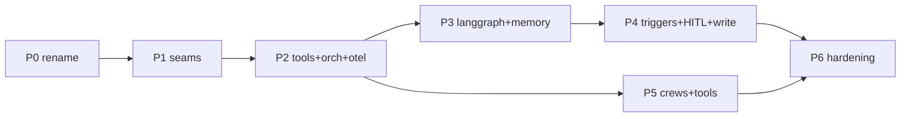

# Implementation Plan for RAG Refactor

> Companion to [`RAG_REFACTOR.md`](./RAG_REFACTOR.md). That doc is the _why/what_; this is
> the _how/when_. Package names follow [`PACKAGE_NAMING.md`](./PACKAGE_NAMING.md); the ideas
> being enabled live in [`AI_IDEAS_FOR_BACKSTAGE.md`](./AI_IDEAS_FOR_BACKSTAGE.md).

## 0. Ground rules (from the review comments)

1. **No backward compatibility.** These plugins have no external audience. We rename freely, delete the legacy `/query/:source` path and the singleton, and design one clean SSE protocol. Nothing needs to keep the old Roadie contract working.
2. **The "open questions / risks" are decisions, not blockers.** They are resolved up front in §1 and baked into the plan rather than tracked as open risks.

## 1. Resolved design decisions

| Topic (was a risk)    | Decision baked into the plan                                                                                                                                                                                                                      |
| --------------------- | ------------------------------------------------------------------------------------------------------------------------------------------------------------------------------------------------------------------------------------------------- |
| Orchestrator runtime  | Run agents **in-process** in the backend by default. Reserve an out-of-process worker only if LangGraph / CrewAI native deps break the `backstage-cli` bundle; the `Orchestrator` interface is transport-agnostic so this stays swappable. <br /> |
| Auth propagation      | Every `Tool.invoke` receives a `ToolContext` carrying `credentials`, `auth`, `discovery`, `logger`, and the initiating `identity`. Tools never read ambient / global creds. <br />                                                                |
| Cost / observability  | OpenTelemetry tracing + per-run token accounting are built in **Phase 2**, before any cyclic agent ships. Every run / step / tool-call is a span. <br />                                                                                          |
| Trigger idempotency   | Every trigger carries an `idempotencyKey`; the runtime persists it and drops duplicate deliveries before an agent starts. <br />                                                                                                                  |
| Attribution / license | Keep the Apache-2.0 header on all derived files; add a `NOTICE` entry recording the Roadie/Larder origin. New files get our own header.                                                                                                           |

## 2. Target package layout

Scope everything under `@webstackbuilders`. Rename the copied packages and add new ones (Directory paths under `plugins/` shown; suffixes per `PACKAGE_NAMING.md`),

**Rename map (copied → new):**

| Current                              | New package                        | Notes                                                    |
| ------------------------------------ | ---------------------------------- | -------------------------------------------------------- |
| `rag-ai-node`                        | `plugin-ai-core-node`              | Shared contracts + registries + extension points. <br /> |
| `rag-ai-backend`                     | `plugin-ai-core-backend`           | Agent runtime host, HTTP + SSE, config. <br />           |
| `rag-ai-backend-retrieval-augmenter` | `plugin-ai-retrieval-node`         | Becomes the `knowledge.retrieve` tool. <br />            |
| `rag-ai-backend-embeddings-openai`   | `plugin-ai-embeddings-openai-node` | Provider module. <br />                                  |
| `rag-ai-backend-embeddings-aws`      | `plugin-ai-embeddings-aws-node`    | Provider module. <br />                                  |
| `rag-ai-storage-pgvector`            | `plugin-ai-storage-pgvector-node`  | Vector store **+ runtime state tables**. <br />          |
| `rag-ai` (frontend)                  | `plugin-ai-core`                   | Agent-run UI + structured-event client.                  |

**New packages:**

| Package                                                       | Purpose                                                                                        |
| ------------------------------------------------------------- | ---------------------------------------------------------------------------------------------- |
| `plugin-ai-core-common`                                       | Types shared frontend/backend: SSE event schema, run/step DTOs. <br />                         |
| `plugin-ai-orchestration-langgraph-node`                      | `LangGraphOrchestrator` + checkpoint adapter. <br />                                           |
| `plugin-ai-orchestration-crew-node`                           | `CrewOrchestrator` (multi-agent). <br />                                                       |
| `plugin-ai-tools-github-node` …                               | Tool packs: `github`, `jira`, `slack`, `pagerduty`, `kubernetes`, `scaffolder`, `cost`. <br /> |
| `plugin-ai-<agent>-backend` (+ `common` / frontend as needed) | One per shipped agent (e.g. `plugin-ai-reviewer-backend`).                                     |

## 3. Shared contracts (`plugin-ai-core-node` / `common`)

Sketch of the core interfaces (final signatures land in Phase 1-2):

```ts
// Open the closed enum.
export type SourceId = string; // replaces EmbeddingsSource union
export interface SourceRegistry {
  register(source: SourceDescriptor): void;
  list(): SourceDescriptor[];
  has(id: SourceId): boolean;
}

// Tools: the unit of "doing".
export interface ToolContext {
  credentials: BackstageCredentials;
  auth: AuthService;
  discovery: DiscoveryService;
  logger: LoggerService;
  identity: string;
  runId: string;
  signal: AbortSignal;
}
export interface Tool<A = unknown, R = unknown> {
  id: string;
  description: string;
  schema: ZodSchema<A>; // validated before invoke
  invoke(args: A, ctx: ToolContext): Promise<R>;
  effect?: 'read' | 'write'; // 'write' → HITL-gateable
}
export interface ToolRegistry {
  register(t: Tool): void;
  get(id: string): Tool | undefined;
  list(): Tool[];
}

// Agents: the unit of "who".
export interface AgentDefinition {
  id: string;
  modelRef: string; // resolved via ModelRegistry
  systemPrompt: string;
  toolIds: string[];
  orchestrator: 'single-shot' | 'langgraph' | 'crew';
  memory?: 'none' | 'session';
  triggers?: TriggerBinding[];
}
export interface AgentRegistry {
  register(a: AgentDefinition): void;
  get(id: string): AgentDefinition | undefined;
  list(): AgentDefinition[];
}

// Orchestrators: the unit of "how".
export interface Orchestrator {
  run(input: AgentRunInput, ctx: RunContext): AsyncIterable<AgentEvent>;
  resume?(
    runId: string,
    decision: ApprovalDecision,
    ctx: RunContext,
  ): AsyncIterable<AgentEvent>;
}

// State
export interface SessionStore {
  /* append/read messages by sessionId */
}
export interface CheckpointStore {
  /* save/load orchestrator state by runId */
}
export interface ArtifactSink {
  record(a: Artifact): Promise<void>;
}
```

Extension points change from **set-once setters** to **registries**: `addAgent`, `addTool`, `addModel`, `addSource`, `addTrigger` (replacing `setAugmentationIndexer` / `setRetrievalPipeline` / `setBaseLLM`).

## 4. Data model & migrations (`plugin-ai-storage-pgvector-node`)

Keep the existing `embeddings` table. Add runtime-state tables in a **new migration** (`*_agent_runtime.js`), reusing the same Knex DB:

| Table            | Key columns                                                                                                                                    |
| ---------------- | ---------------------------------------------------------------------------------------------------------------------------------------------- |
| `ai_sessions`    | `id`, `agent_id`, `user_ref`, `created_at`, `metadata`                                                                                         |
| `ai_messages`    | `id`, `session_id`, `role`, `content`, `token_usage`, `created_at`                                                                             |
| `ai_runs`        | `id`, `agent_id`, `session_id?`, `status` (`running / paused / done / error`), `trigger`, `idempotency_key` (unique), `started_at`, `ended_at` |
| `ai_run_steps`   | `id`, `run_id`, `seq`, `type` (`step / tool_call / tool_result / approval`), `payload`, `created_at`                                           |
| `ai_checkpoints` | `run_id` (pk), `state` (jsonb), `updated_at`                                                                                                   |
| `ai_artifacts`   | `id`, `run_id`, `kind` (`pr / issue / doc /...`), `ref`, `url`, `created_at`                                                                   |
| `ai_approvals`   | `id`, `run_id`, `status` (`pending / approved / rejected`), `requested_at`, `decided_at`, `decided_by`                                         |

Add a `source` column (or index the existing `metadata->>'source'`) on `embeddings` so new sources index alongside catalog/tech-docs.

## 5. HTTP + SSE protocol (`plugin-ai-core-backend`)

Clean surface (no legacy routes):

- `GET  /agents` — list registered agents.
- `POST /agents/:id/runs` — start a run (body: input, optional `sessionId`, `idempotencyKey`); returns run id and opens the SSE stream.
- `GET  /runs/:id/events` — SSE stream (reconnectable).
- `POST /runs/:id/approvals` — HITL resume (`approved` / `rejected` + note).
- `POST /triggers/:source` + `POST /webhooks/:provider` — event/cron/webhook intake.

**SSE event schema** (typed in `plugin-ai-core-common`):

```
event: step            data: { runId, seq, node, phase: 'enter'|'exit' }
event: token           data: { runId, text }            // streamed model text
event: tool_call       data: { runId, tool, args }
event: tool_result     data: { runId, tool, ok, summary }
event: approval_request data: { runId, approvalId, reason, effect }
event: artifact        data: { runId, kind, url }
event: usage           data: { runId, input, output, total }
event: done | error    data: { runId, ... }
```

## 6. Config schema (`config.d.ts` in `plugin-ai-core-backend`)

Replace global `ai.prompts.prefix/suffix` with per-agent config plus defaults:

```yaml
ai:
  defaults: { model: openai-gpt4o, systemPrompt: '...' }
  sources: ['catalog', 'tech-docs'] # extended by source modules
  models:
    openai-gpt4o: { provider: openai, model: gpt-4o }
  agents:
    service-contextualizer:
      model: openai-gpt4o
      orchestrator: single-shot
      tools: ['knowledge.retrieve']
  tracing: { otlpEndpoint: '...' }
```

## 7. Phased delivery plan

Each phase is independently shippable and ends with a **Definition of Done (DoD)**.

### Phase 0 — Repo prep & rename

- Rename packages per §2 (`package.json` name + all `@webstackbuilders/*` imports → `@webstackbuilders/*`).
- Update `create-plugin` / `new` scope in root scripts to `@webstackbuilders`.
- Add `NOTICE` attribution; keep Apache headers.
- Green `yarn build` + `yarn tsc:full` + `yarn test` after rename.
- **DoD:** monorepo builds and tests pass under new names; app + backend still boot.

### Phase 1 — Seams (no new capability)

- `SourceId = string` + `SourceRegistry`; move `sourceValidator` to the registry.
- Convert extension points to registries (`addAgent / addTool / addModel / addSource`).
- Delete `RagAiController` singleton; instantiate per run.
- Per-agent model + prompt resolved from config; global values become defaults.
- **DoD:** existing chat behavior reproduced via a single built-in `service-contextualizer` agent registered through the new registries; two agents can coexist in one backend.

### Phase 2 — Tool + Orchestrator core + observability

- Add `Tool`/`ToolContext`/`ToolRegistry`; wrap the retrieval pipeline as `knowledge.retrieve`.
- Extract `LlmService` → `SingleShotOrchestrator implements Orchestrator`.
- Add `AgentRuntime` that resolves agent → orchestrator → streams `AgentEvent`s.
- Wire OTel spans + token accounting for run/step/tool.
- New SSE protocol (§5) end to end; frontend client updated to consume typed events.
- **DoD:** `service-contextualizer` runs through `AgentRuntime` + `knowledge.retrieve` with parity to today's answers; traces and token usage visible per run.

### Phase 3 — Stateful agents (LangGraph) + memory

- `plugin-ai-orchestration-langgraph-node`: `LangGraphOrchestrator` + `CheckpointStore` adapter.
- Implement `SessionStore` (`ai_sessions`/`ai_messages`); enable `memory: 'session'`.
- Ship one stateful agent end to end: **Codebase Tour Guide** (conversational RAG) or **Incident Responder** (investigate → gather → summarize).
- **DoD:** multi-turn conversation with retained context; a graph run checkpoints and can be resumed after a process restart.

### Phase 4 — Triggers + HITL + artifacts (first write agent)

- Trigger intake: Backstage events, cron (scheduler), webhooks; idempotency-key dedupe.
- `ArtifactSink` (`ai_artifacts`) + `ai_approvals` + `POST /runs/:id/approvals` resume path.
- Ship a write-capable agent behind HITL: **PR Reviewer** or **Security Remediation** (uses `plugin-ai-tools-github-node`).
- **DoD:** an event/cron trigger starts a run; a `write` tool call pauses on
  `approval_request` and only executes after approval; artifact recorded and surfaced in UI.

### Phase 5 — Crews + tool packs

- `plugin-ai-orchestration-crew-node`: role-based multi-agent runs.
- Flesh out tool packs (`jira`, `slack`, `pagerduty`, `kubernetes`, `scaffolder`, `cost`).
- Ship one crew: **Doc Janitor** (Writer/Researcher/Reviewer) or **Cost Crew**.
- **DoD:** a crew of ≥ 2 agents with distinct prompts/models collaborates to produce an artifact; each role visible as steps in the run stream.

### Phase 6 — Hardening

- Rate limits, per-agent budgets/timeouts, cancellation via `AbortSignal`, retry/backoff.
- Redaction in traces/logs; audit log for write actions.
- **DoD:** load/timeout/cancel behaviors covered by tests; audit log for every write.

## 8. Frontend plan (`plugin-ai-core`)

- Replace `RagAiApi.ask(question, source)` with a run-oriented client:
  `startRun(agentId, input, opts)` returning a typed `AsyncGenerator<AgentEvent>` (still SSE, parsed by `eventsource-parser`).
- New UI affordances: agent picker, step/tool timeline, approval prompt, artifact links.
- Keep the existing `RagModal` as the `single-shot`/chat view over the new client.

## 9. Testing & quality strategy

- **Unit:** registries, source validation, tool schema validation, orchestrator step emission (mock model + mock tools).
- **Integration:** `AgentRuntime` over a fake LLM asserting the exact SSE event sequence; pgvector state tables via the repo's DB test harness; HITL pause/resume; idempotency dedupe.
- **Contract:** `plugin-ai-core-common` SSE schema shared by backend emitters and frontend parser.
- **Migrations:** `up`/`down` tested; `embeddings` table untouched by new migration.
- Keep `backstage-cli repo test`, `lint`, and `tsc:full` green each phase.

## 10. Sequencing & milestones



- **M1 (P0-P1):** renamed, registry-based, multi-agent-capable core; chat parity.
- **M2 (P2-P3):** tool/orchestrator runtime + first stateful agent with memory + tracing.
- **M3 (P4-P5):** triggers, HITL, first write agent, first crew.
- **M4 (P6):** hardened for real use.

## 11. Work breakdown checklist

- [x] P0: rename packages + imports to `@webstackbuilders/*`; NOTICE; green build.
- [x] P1: `SourceRegistry`; registry extension points; de-singleton; per-agent model/prompt.
- [x] P2: `Tool`/`ToolContext`; `knowledge.retrieve`; `SingleShotOrchestrator`; `AgentRuntime`; OTel + usage; new SSE + FE client.
- [ ] P3: `LangGraphOrchestrator` + `CheckpointStore`; `SessionStore`; ship first stateful agent.
- [ ] P4: triggers (event/cron/webhook) + idempotency; `ArtifactSink`; approvals + resume; ship first write agent.
- [ ] P5: `CrewOrchestrator`; tool packs; ship first crew.
- [ ] P6: budgets/timeouts/cancel/retry; redaction + audit log.
