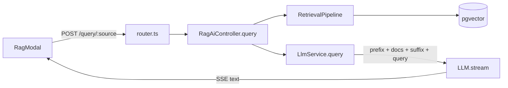
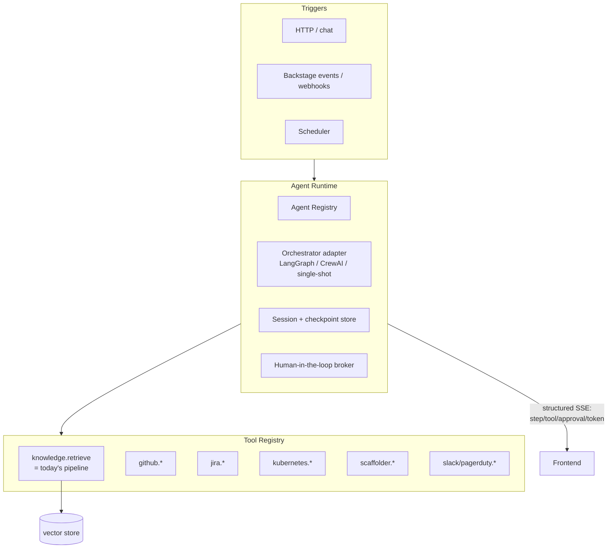

# RAG Refactor

## TL;DR

The Roadie plugins are a solid **retrieval + single-shot completion** engine. Almost every idea in the ideas doc needs **multi-step, stateful, tool-using agents** (LangGraph loops and CrewAI crews) that can _act_ on external systems, not just answer questions.

The refactor is therefore less about rewriting retrieval and more about **adding an agent runtime layer on top of it** and **generalizing the seams that are currently hardcoded to "one model, one pipeline, one query endpoint, catalog/tech-docs only."**

Keep: the vector store, embeddings modules, and the retriever/router/post-processor pipeline — they become _one tool_ ("knowledge retrieval") available to agents.

## Summary of Plan

We transformed the original Roadie RAG plugins from a single-assistant, retrieval-only chat flow into a full agent platform while preserving retrieval quality as a core capability: we introduced an extensible agent runtime with registries for agents, tools, models, sources, and triggers; wrapped the existing retrieval pipeline as a first-class tool (`knowledge.retrieve`); added stateful orchestration support (including cyclic workflows), multi-agent role collaboration, human-in-the-loop approval/resume paths for write operations, structured run/step/tool streaming over SSE, and persistent runtime state (sessions, runs, steps, checkpoints, approvals, artifacts) backed by PostgreSQL alongside pgvector. We also delivered trigger-based execution (HTTP, events, cron/webhooks), integrated operational tool packs (for systems such as GitHub/Jira/Slack/PagerDuty/Kubernetes/Scaffolder/cost use cases), moved configuration to per-agent model/prompt/tool policies with sensible defaults, and hardened the platform for real use with observability, token/cost accounting, idempotency, and reliability controls. In parallel, we completed the package modernization and integration work required to run this cleanly in our Backstage monorepo (renamed/scope-aligned packages, frontend API provider wiring for notifications/search, module resolution and federation fixes, and strict Yarn PnP compatibility), resulting in a stable foundation where development, linting, testing, and type-checking all pass consistently.

## 1. Current architecture (as copied)

Packages and responsibilities:

| Package                                            | Role                                                                                                   |
| -------------------------------------------------- | ------------------------------------------------------------------------------------------------------ |
| `rag-ai-node`                                      | Shared types + backend extension points (`AugmentationIndexer`, `RetrievalPipeline`, `model`).         |
| `plugin-ai-core-backend`                           | Plugin wiring, `LlmService` (single prompt → stream), `RagAiController` (SSE), `router.ts` (2 routes). |
| `plugin-ai-core-backend-embeddings-aws` / `openai` | Provider-specific embeddings + augmenter.                                                              |
| `plugin-ai-core-backend-retrieval-augmenter`       | `DefaultRetrievalPipeline` = routers → retrievers → post-processors.                                   |
| `rag-ai-storage-pgvector`                          | `RoadieVectorStore` on pgvector.                                                                       |
| `rag-ai` (frontend)                                | `RagModal` chat UI + `ragApi` client.                                                                  |

Request flow today:

Key characteristics that matter for the refactor:

- **Single-shot completion.** `LlmService.query` builds one `prefix + embeddings + suffix + query` string and calls `model.stream(prompt)`. No loop, no tool calls, no intermediate steps.
- **Singletons / "set once".** `RagAiController.getInstance` is a singleton and the extension points throw if set twice (`model`, `augmentationIndexer`, `retrievalPipeline` "may only be set once"). One backend = one assistant.
- **Closed source enum.** `EmbeddingsSource = 'catalog' | 'tech-docs' | 'all'` is a union type baked into `rag-ai-node` and validated in `router.ts`.
- **Stateless.** No session, memory, or checkpoint. Every query is independent.
- **Retrieval-only.** The pipeline can _read_ context; there is no abstraction for the agent to _do_ anything (open a PR, page on-call, write TechDocs, run a Scaffolder task).
- **Transport = raw SSE text.** `events: embeddings | response | usage`. No structured agent-step / tool-call / approval events.

---

## 2. What the ideas actually require

Grouping the 27 ideas by the capability they demand (beyond plain RAG):

| Capability the idea needs                                                            | Example ideas                                                                      | Present today?        |
| ------------------------------------------------------------------------------------ | ---------------------------------------------------------------------------------- | --------------------- |
| **Tool / action calling** (write to GitHub, Jira, Slack, PagerDuty, K8s, Scaffolder) | Security Remediation, PR Reviewer, Release Notes, Shadow IT Detective, Alert Tuner | ❌                    |
| **Cyclic / stateful workflow** (try→fail→learn→retry)                                | Bridge Builder migration, Synthetic Test Gen, Incident Responder                   | ❌                    |
| **Multi-agent / role collaboration** (crews)                                         | License Auditor, Cost Crew, Doc Janitor, RFC Reviewer, PRD Pipeline                | ❌                    |
| **Human-in-the-loop** approval/pause-resume                                          | Security Remediation, Policy Judge, migrations                                     | ❌                    |
| **Event / schedule triggers** (not just HTTP request)                                | Drift Detector, Tech Radar, Goldilocks Tuner, Post-Mortem, Handover                | ❌                    |
| **Session memory / conversation**                                                    | Tour Guide, Handover, Context-Aware Search                                         | ❌                    |
| **Many heterogeneous sources** (PRs, commits, Jira, Slack, cloud, cost)              | Microservice Archeology, Context-Aware Search, Shadow IT                           | ⚠️ enum-limited       |
| **Per-agent model + prompt**                                                         | all crews (different roles → different system prompts)                             | ❌ (global config)    |
| **Retrieval-augmented Q&A**                                                          | Service Contextualizer, Archeology, Context-Aware Search                           | ✅ (this is the keep) |

Conclusion: retrieval is ~1 of 9 needed capabilities. The refactor adds the other 8 as a runtime the retrieval engine plugs into.

---

## 3. Target architecture

Introduce an **Agent Runtime** layer. Retrieval becomes a registered _tool_; each idea
becomes an _agent definition_ (or crew) that composes tools, a model, a prompt, memory, and a trigger.

### 3.1 Core new abstractions (land in the `-node` package)

- **`Tool`** — `{ id, description, schema (zod), invoke(args, ctx): Promise<result> }`. Wrap the existing `RetrievalPipeline` as the first tool: `knowledge.retrieve`. Backstage-native context (`auth`, `discovery`, `logger`, `credentials`) flows via `ctx`.
- **`AgentDefinition`** — `{ id, model, systemPrompt, tools[], memory?, orchestrator }`. Each plugin (e.g. `plugin-ai-reviewer-backend`) contributes one or more definitions through an extension point instead of the current "set once" model.
- **`Orchestrator`** — strategy interface with implementations:
  - `SingleShotOrchestrator` (today's `LlmService` behavior — the trivial case),
  - `LangGraphOrchestrator` (stateful graph, checkpointing, cycles, HITL interrupts),
  - `CrewOrchestrator` (role-based multi-agent).
- **`SessionStore` / `CheckpointStore`** — conversation memory and graph checkpoints. Reuse the existing pgvector Knex DB; add tables rather than a new datastore.
- **`Trigger`** — adapters that start an agent run: HTTP chat, Backstage events, cron.
- **`ArtifactSink` / effects** — typed outputs (PR opened, Jira created, TechDoc written) so results are auditable and testable, and so HITL can gate side effects.

### 3.2 Make the current pieces pluggable, not singletons

- Replace `EmbeddingsSource` union with an **open `string` + a `SourceRegistry`**. Sources register themselves (`catalog`, `tech-docs`, `github-pr`, `jira`, `commits`, `cloud`, …). `sourceValidator` in `router.ts` validates against the registry, not a literal list.
- Replace "may only be set once" extension points with **registries** keyed by id (`AgentRegistry`, `ToolRegistry`, `ModelRegistry`). Multiple agents coexist in one backend.
- Make `RagAiController` **not a singleton**; instantiate per request/run with the resolved agent. The singleton currently prevents more than one assistant per backend.
- Allow **per-agent model + prompt** instead of the global `ai.prompts.prefix/suffix`. Keep global config as defaults.

### 3.3 Transport: structured agent events

Extend the SSE contract from `embeddings | response | usage` to also emit:

- `event: step` (agent/graph node entered/exited),
- `event: tool_call` / `event: tool_result`,
- `event: approval_request` (HITL) + a resume endpoint,
- `event: artifact` (PR/issue/doc created),
- keep `token`/`response` for streamed text and `usage` for accounting.

This is backward compatible — the existing chat UI keeps working; agentic UIs subscribe to the richer events.

---

## 4. Package-by-package changes

### `rag-ai-node` → `plugin-ai-core-node` (shared contracts)

- Add `Tool`, `AgentDefinition`, `Orchestrator`, `SessionStore`, `CheckpointStore`, `Trigger`, `ArtifactSink`, `SourceRegistry`, `ToolRegistry`, `AgentRegistry` types.
- Change `EmbeddingsSource` to `string` + registry; deprecate the union.
- Convert `*ExtensionPoint` from set-once setters to `add*(...)` registries.

### `plugin-ai-core-backend` → `plugin-ai-core-backend` (runtime host)

- Extract `LlmService` into `SingleShotOrchestrator` implementing the new `Orchestrator`.
- Add `AgentRuntime` (resolve agent → build orchestrator → run → stream structured events).
- `router.ts`: keep `/query/:source` (back-compat, routes to a default assistant agent); add `/agents`, `/agents/:id/invoke`, `/runs/:id`, `/runs/:id/approve` (HITL resume), and trigger intake (`/events`, webhook endpoints).
- Move source validation to the `SourceRegistry`.

### `plugin-ai-core-backend-retrieval-augmenter` → `plugin-ai-retrieval-*`

- Unchanged internally; **expose the pipeline as a `knowledge.retrieve` `Tool`**.
- This package stops being the center of gravity and becomes "the retrieval tool."

### embeddings + storage packages

- Largely unchanged. Add source-scoped metadata so new sources (PRs, commits, Jira) can be indexed the same way catalog/tech-docs are. Reuse the Knex DB for session/checkpoint tables.

### New packages to add (per idea group, following `PACKAGE_NAMING.md` suffixes)

- `plugin-ai-orchestration-langgraph-node` — LangGraph orchestrator + checkpointing.
- `plugin-ai-orchestration-crew-node` — CrewAI-style multi-agent orchestrator.
- `plugin-ai-tools-*-node` — tool packs: `github`, `jira`, `slack`, `pagerduty`, `kubernetes`, `scaffolder`, `cost` (map directly to the integrations the ideas name).
- One plugin per shipped agent, e.g. `plugin-ai-reviewer-backend`,
  `plugin-ai-incident-responder-backend`, `plugin-ai-doc-janitor-backend`, each just an `AgentDefinition` + its tools + trigger. Frontends only where an interactive UI is needed.

---

## 5. Reference mappings (sanity check the design)

- **Service Contextualizer / Context-Aware Search / Archeology** → single-shot or small LangGraph agent using only `knowledge.retrieve` over more sources. Closest to today; good first migration target to prove the `Tool` + registry refactor without orchestration risk.
- **Incident Responder / Bridge Builder / Synthetic Tests** → `LangGraphOrchestrator` (cycles, checkpoints, retries) + tool packs + `event/cron` triggers.
- **License Auditor / Cost Crew / Doc Janitor / RFC Reviewer / PRD Pipeline** → `CrewOrchestrator` (multiple `AgentDefinition`s with distinct system prompts/models).
- **Security Remediation / Policy Judge** → LangGraph + `approval_request` HITL + `ArtifactSink`.
- **Drift Detector / Tech Radar / Goldilocks Tuner / Handover / Post-Mortem** → `cron` / event triggers feeding otherwise-standard agents.

Every idea decomposes into: _(orchestrator) + (tools) + (trigger) + (model/prompt)_ — which validates the four abstractions above.

---

## 6. Suggested phasing

1. **Seams first (no behavior change):** open the `EmbeddingsSource` type, convert set-once extension points to registries, de-singleton `RagAiController`, per-agent model/prompt. Existing chat keeps working.
2. **Tool + Orchestrator abstractions:** wrap retrieval as `knowledge.retrieve`; refactor `LlmService` into `SingleShotOrchestrator`. Prove parity with today's `/query`.
3. **LangGraph orchestrator + session/checkpoint store + structured SSE events.** Ship one real stateful agent (Incident Responder or Codebase Tour Guide) end to end.
4. **Triggers + HITL + ArtifactSink.** Add event / cron intake and approval flow; ship a write-capable agent (PR Reviewer or Security Remediation).
5. **CrewOrchestrator + tool packs.** Ship a crew (Doc Janitor or Cost Crew).

## 7. Open questions / risks

- **Orchestrator dependency:** LangGraph.js + CrewAI maturity in a Backstage backend (bundling, native deps). Consider an out-of-process agent worker if bundling fights the CLI.
- **Auth propagation to tools:** every tool that writes to GitHub/Jira/etc. must run with the right Backstage identity/credentials via `ctx`; design this into the `Tool` contract early.
- **Cost/observability:** multi-step agents multiply token spend — extend the existing `usage` accounting into per-run tracing (OTel/LangSmith) before shipping cyclic agents.
- **Idempotency for triggers:** event/cron agents that open PRs must be safe against replays.
- **License headers:** copied files retain the Larder/Roadie Apache-2.0 header — keep it on derived files and record attribution as you fork.

## 8. User Comments

- In section 3.3, you mention extending the SSE contract from `embeddings | response | usage` while keeping backward compatability. We do not need to worry about backwards compatability - we are starting fresh. Let's do everything to make the refactored plugins work for us - they have no other audience.
- All of the "Open questions / risks" in section 7 seem like risks more than questions. Let's assume we can address these in our refactor.
