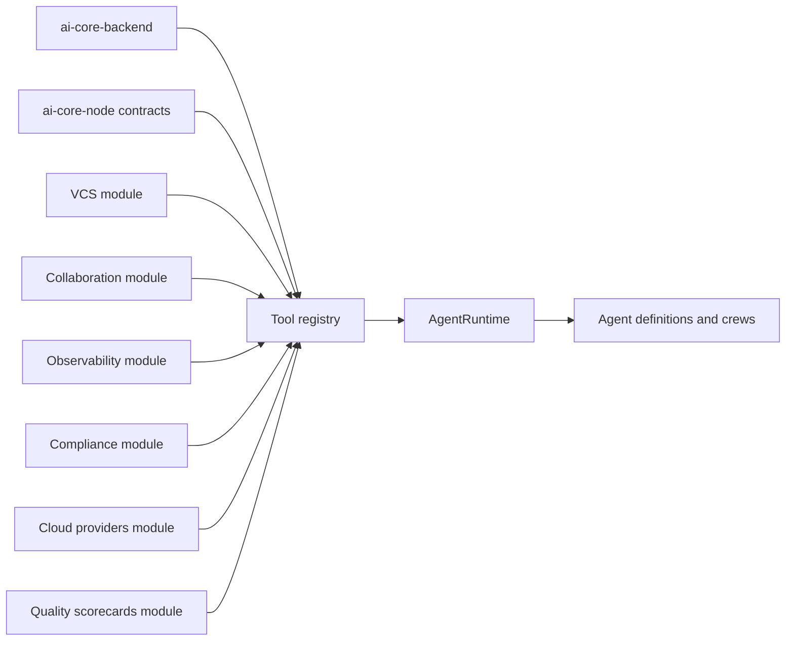

# Third-Party Integration Modules Plan

This document is an implementation plan for AI Crew Suite integration modules that handle groups of required sibling plugins with similar functionality, like VCS plugins for GitHub, GitLab, Bitbucket, and Azure DevOps. The goal is to not create one module per vendor and instead to create a small number of capability-oriented modules that register stable AI tools while hiding vendor-specific client details behind provider drivers.

## Sibling Plugin Groups

| Module                                      | Primary capability boundary                                                                 | Example vendors and Backstage services                                                                         |
| ------------------------------------------- | ------------------------------------------------------------------------------------------- | -------------------------------------------------------------------------------------------------------------- |
| `ai-core-backend-module-vcs`                | Source control, repository reading, branches, commits, pull requests, code review metadata. | GitHub, GitLab, Bitbucket, Azure DevOps, `coreServices.urlReader`, Backstage integrations.                     |
| `ai-core-backend-module-collaboration`      | Human communication, ticketing, work coordination, notifications.                           | Slack, Microsoft Teams, Jira, Linear, email-like notification services.                                        |
| `ai-core-backend-module-observability`      | Runtime signals, incidents, alerts, metrics, logs, traces.                                  | PagerDuty, Opsgenie, Datadog, New Relic, Splunk, OpenTelemetry, Jaeger.                                        |
| `ai-core-backend-module-compliance`         | Policy, permission, governance, FinOps and security validation.                             | OPA/Rego, Backstage permission policies, static architecture policy registries, cost policy sources.           |
| `ai-core-backend-module-cloud-providers`    | Cloud resource lookup, infrastructure context, account/project/subscription metadata.       | AWS, Azure, GCP, Kubernetes where the operation is infrastructure inventory rather than runtime observability. |
| `ai-core-backend-module-quality-scorecards` | Service health, scorecards, ownership quality, maturity signals.                            | Soundcheck, Scorecards, Tech Radar, catalog annotations, internal quality systems.                             |

Do not scaffold additional modules yet. The six groups are broad enough for the immediate agent ideas and let us avoid premature package sprawl. Revisit grouping only after one real workflow forces a capability that does not naturally fit these boundaries.

Backstage core services should not become their own module group yet. Catalog, TechDocs, Search, Scaffolder, Kubernetes, permissions, and URL reading are platform dependencies used by the six modules and the new AI agentic workflow plugins where appropriate.

All six modules should register tools through `toolExtensionPoint` from `@webstackbuilders/plugin-ai-core-node`.

## Architecture Model



The core runtime stays blind to vendor SDKs. Modules register stable tools. Agents depend on those stable tool IDs. Provider drivers inside a module decide whether a call goes to GitHub, GitLab, Jira, PagerDuty, OPA, AWS, Azure, GCP, or an internal system.

## Tool Contract Strategy

Use the existing AI Core `Tool` contract, not a parallel tool registry abstraction.

```typescript
import type { Tool } from '@webstackbuilders/plugin-ai-core-node';

export const exampleTool: Tool = {
  id: 'vcs.pull_request.open',
  description: 'Open a pull request for a proposed repository change',
  effect: 'write',
  schema: undefined,
  async invoke(args, ctx) {
    // Resolve driver from module config and use ctx.logger, ctx.identity,
    // ctx.runId, and ctx.signal for observability and cancellation.
  },
};
```

The current shared `schema` field is intentionally typed as `unknown`. Module implementations may use Zod, JSON Schema, or provider-local validation internally, but the first implementation pass should not introduce a new mandatory schema system into `ai-core-node` unless a runtime consumer needs it.

Tool IDs should follow this shape:

```text
<domain>.<resource-or-context>.<verb>
```

Examples:

- `vcs.repository.read_file`
- `vcs.pull_request.open`
- `collaboration.ticket.search`
- `collaboration.message.post`
- `observability.incident.list_active`
- `observability.metrics.query`
- `compliance.policy.evaluate`
- `cloud.resource.lookup`
- `quality.scorecard.get`

Use `effect: 'read'` for context-gathering tools and `effect: 'write'` for tools that mutate external systems. Write tools must be designed for human-in-the-loop approval and audit logging.

## Provider Driver Pattern

Each category module should expose a small internal driver interface and one or more provider implementations.

```text
src/
  module.ts
  tools/
    registerTools.ts
  providers/
    types.ts
    github.ts
    gitlab.ts
    azureDevOps.ts
  config.ts
  __tests__/
```

The module boot sequence should be:

1. Read category config from `coreServices.rootConfig`.
2. Build one or more provider drivers.
3. Register stable AI tools with `toolExtensionPoint`.
4. Keep all provider-specific auth, API clients, retries, pagination, and response normalization inside the module.
5. Return compact, serializable tool results suitable for `tool_result` events and artifact persistence.

Prefer Backstage platform services where they already solve auth or discovery:

- Use `coreServices.urlReader` for repository file reads before adding direct VCS SDK reads.
- Use Catalog APIs for entity ownership, systems, resources, and relations.
- Use Backstage permissions for user capability checks before write operations.
- Use Backstage integrations config for provider host credentials where applicable.

## Configuration Shape

Use one top-level config namespace under the existing `ai` key so provider modules remain discoverable with the rest of AI Core.

```yaml
ai:
  integrations:
    vcs:
      provider: github
      github:
        host: github.com
    collaboration:
      ticketing: jira
      messaging: slack
    observability:
      alerting: pagerduty
      metrics: datadog
      traces: opentelemetry
    compliance:
      opa:
        baseUrl: http://localhost:8181
      staticPolicies:
        path: ./config/ai-policies.yaml
    cloudProviders:
      defaultProvider: aws
      aws:
        region: us-east-1
    qualityScorecards:
      provider: soundcheck
```

This document intentionally proposes `ai.integrations.*` rather than `aiCore.providers.*` so it matches the current repo's `ai.*` configuration pattern.

Each module should own its config schema in its package `config.d.ts`. The schemas should describe provider selection, provider-specific connection details, and feature toggles. Secrets should continue to flow through environment variables, Backstage integrations, or host-specific credential managers rather than hardcoded config literals.

## Module Capability Plans

### VCS Module

Primary purpose: repository context and code-change writeback.

Initial read tools:

- `vcs.repository.get_metadata`: Return repo default branch, provider, URL, owner, and visibility where available.
- `vcs.repository.read_file`: Read a file by repo/ref/path, preferably through `coreServices.urlReader`.
- `vcs.repository.search`: Search repository content or metadata when provider APIs support it.
- `vcs.pull_request.list`: Return active PRs for a repo or entity.

Initial write tools:

- `vcs.branch.create`: Create an isolated branch for an agent proposal.
- `vcs.commit.create`: Commit generated file changes to the branch.
- `vcs.pull_request.open`: Open a PR with generated summary and metadata.

Implementation notes:

- Start with GitHub because Backstage integration support and SDK maturity are strongest.
- Model provider-specific PR creation behind a shared `VcsDriver` interface.
- Require HITL approval before `branch.create`, `commit.create`, or `pull_request.open` are called by production agents.

### Collaboration Module

Primary purpose: work coordination and human communication.

Initial read tools:

- `collaboration.ticket.search`: Search tickets by query, service, team, or incident reference.
- `collaboration.ticket.get`: Fetch ticket details and linked discussions.
- `collaboration.channel.lookup`: Resolve a team or service to a messaging channel.

Initial write tools:

- `collaboration.ticket.create`: Create Jira, Linear, or equivalent tickets from an agent artifact.
- `collaboration.ticket.comment`: Add a comment with trace/run links.
- `collaboration.message.post`: Post a summary to Slack, Teams, or equivalent messaging.

Implementation notes:

- Ticketing and messaging can live in one collaboration module for now because they share human workflow semantics.
- If chat/messaging grows into interactive bot behavior, split messaging into a dedicated module later.

### Observability Module

Primary purpose: runtime signals and incident context.

Initial read tools:

- `observability.incident.list_active`: List active incidents for a service, team, or escalation policy.
- `observability.alert.history`: Return alert history and noise patterns for a service.
- `observability.metrics.query`: Query metrics over a bounded time window.
- `observability.logs.search`: Search logs around a time range and entity.
- `observability.traces.search`: Search traces by service, operation, or error signature.

Initial write tools:

- `observability.incident.annotate`: Add a diagnostic note or run link to an incident.
- `observability.alert.suggest_tuning`: Produce a provider-normalized alert tuning artifact. Defer applying changes until a real write path is approved.

Implementation notes:

- PagerDuty and Opsgenie belong here because they are incident/on-call systems, even though they also notify humans.
- OpenTelemetry and Jaeger should start as trace/query drivers, not model-provider concerns.

### Compliance Module

Primary purpose: policy evaluation, permission checks, and governance feedback.

Initial read/evaluate tools:

- `compliance.policy.evaluate`: Evaluate generated IaC, config, or proposed actions against OPA/Rego or static policy bundles.
- `compliance.permission.check`: Ask whether the triggering user can perform a requested class of action.
- `compliance.architecture.validate`: Validate proposed architecture against internal static constraints.
- `compliance.cost.estimate`: Estimate or classify cost impact when the source of truth is a governance/FinOps system.

Implementation notes:

- Keep policy evaluation separate from cloud inventory. Compliance can call cloud-provider tools through agents if it needs resource context.
- Backstage permission policy integration should live here because it answers whether an action is allowed, not how to perform the action.
- Cost estimation can start here. If it becomes provider inventory-heavy, split `cost` into cloud providers later.

### Cloud Providers Module

Primary purpose: cloud inventory, ownership, and infrastructure context.

Initial read tools:

- `cloud.account.lookup`: Resolve cloud account/project/subscription metadata.
- `cloud.resource.lookup`: Find existing resources by service, tags, owner, or catalog entity.
- `cloud.resource.dependencies`: Return cloud dependencies around a service.
- `cloud.kubernetes.workloads`: Inspect Kubernetes workloads when the query is about deployed infrastructure state.

Initial write tools:

- Defer direct cloud mutation tools until there is a specific approved agent workflow. Most first-pass cloud tools should be read-only.

Implementation notes:

- AWS, Azure, and GCP should be drivers under one module because agents need provider-neutral infrastructure context first.
- Kubernetes can start here for workload inventory. If Kubernetes remediation grows large, split it later.

### Quality Scorecards Module

Primary purpose: service quality, standards, maturity, and readiness signals.

Initial read tools:

- `quality.scorecard.get`: Fetch scorecard or Soundcheck results for an entity.
- `quality.checks.list`: Return failed checks and metadata.
- `quality.tech_radar.lookup`: Resolve approved technologies or lifecycle status.
- `quality.service_profile.get`: Compose catalog metadata, ownership, scorecards, and standards into a normalized quality profile.

Implementation notes:

- Keep this separate from compliance. Compliance answers allowed/not allowed; quality scorecards answer health, maturity, and improvement opportunities.
- Tech Radar belongs here unless it is used strictly as a policy enforcement source.

## Backstage Core Plugin Dependencies

Backstage core plugins are cross-cutting dependencies, not separate AI tool-pack modules yet. This is included here for reference - there is no implementation planned for the Core Plugin Dependencies at present, so skip this.

| Backstage capability | Planned usage                                                                                                      |
| -------------------- | ------------------------------------------------------------------------------------------------------------------ |
| Catalog              | Resolve entity ownership, systems, resources, relations, annotations, tags, and service identity.                  |
| TechDocs             | Already indexed through retrieval augmenter; future tools may fetch page metadata or source locations.             |
| Search               | Already used by retrieval augmenter for additional query context.                                                  |
| Scaffolder           | Register write tools for component creation or template execution under collaboration/cloud workflows when needed. |
| Kubernetes           | Start as cloud-provider runtime inventory unless remediation workflows justify a dedicated module.                 |
| Permissions          | Used by compliance and write tools to validate whether the actor may perform an action.                            |
| URL Reader           | Preferred path for reading repository content before provider-specific SDK fallback.                               |

## Agent Workflow Fit

The six modules cover the known workflow ideas without requiring one package per vendor. This is included here for reference, so skip this.

| Workflow idea             | Modules involved                                                          |
| ------------------------- | ------------------------------------------------------------------------- |
| PR reviewer               | VCS, quality scorecards, compliance, `knowledge.retrieve`.                |
| Incident responder        | Observability, collaboration, VCS, cloud providers, `knowledge.retrieve`. |
| Alert tuner               | Observability, compliance, VCS, collaboration.                            |
| Release notes generator   | VCS, collaboration, quality scorecards.                                   |
| Scaffolder drift detector | VCS, cloud providers, compliance, quality scorecards.                     |
| Tech debt scout           | Quality scorecards, VCS, observability, `knowledge.retrieve`.             |
| Security remediation      | Compliance, VCS, cloud providers, collaboration, HITL approvals.          |
| Cost crew                 | Cloud providers, compliance, quality scorecards, collaboration.           |

## Rollout Plan

### Phase 0: Normalize Scaffolds

- Add direct dependencies on `@webstackbuilders/plugin-ai-core-node` and any Backstage service packages each module actually uses.
- Convert generated Jest-style package test scripts to the repo's Vitest pattern when tests are added.
- Add minimal README files using the internal core-plugin developer template.

### Phase 1: Shared Tool Patterns

- Add per-module `providers/types.ts` driver interfaces.
- Add per-module `config.ts` helpers for provider selection and validation.
- Add `tools/registerTools.ts` to keep module boot thin.
- Register one read-only tool per module through `toolExtensionPoint`.
- Write unit tests around config validation, driver selection, and tool invocation.

### Phase 2: First Real Workflow Slice

Use one workflow to prove cross-module composition before filling out every provider. Recommended first slice: PR reviewer.

Required initial tools:

- `vcs.repository.read_file`
- `vcs.pull_request.list`
- `quality.scorecard.get`
- `compliance.policy.evaluate`
- `vcs.pull_request.open` behind approval

Definition of done:

- One agent can gather repository context, retrieve knowledge, evaluate quality/policy context, request approval, and open a PR or produce a PR-ready artifact.
- Every write action emits auditable run events and respects `effect: 'write'`.

### Phase 3: Observability and Collaboration Slice

Use an alert or incident workflow to prove operational context.

Required initial tools:

- `observability.incident.list_active`
- `observability.alert.history`
- `observability.metrics.query`
- `collaboration.ticket.search`
- `collaboration.message.post` behind approval

Definition of done:

- One agent can summarize incident context, suggest tuning or follow-up work, and coordinate with a human-facing system after approval.

### Phase 4: Cloud and Compliance Expansion

Add infrastructure context and governance loops.

Required initial tools:

- `cloud.account.lookup`
- `cloud.resource.lookup`
- `cloud.resource.dependencies`
- `compliance.permission.check`
- `compliance.cost.estimate`

Definition of done:

- One agent can reason about ownership, existing cloud resources, permissions, policy, and cost before proposing infrastructure changes.

## Testing Strategy

Each module should include:

- Config validation tests for provider selection and missing required settings.
- Driver tests with provider SDKs mocked behind the module's driver interface.
- Tool invocation tests that assert normalized output, `effect`, and error behavior.
- Registration tests that assert the expected tool IDs are added through `toolExtensionPoint`.
- Approval-path tests for write tools once they are connected to real workflows.

Cross-module workflow tests should live closer to the agent/workflow package that composes the tools, not inside each provider module.

## Open Planning Questions

The likely future decision to make for additional additional plugins involves cost. Start cost estimation in `compliance` when it is policy/FinOps validation. Move cost inventory into `cloud-providers` if it becomes provider-resource analysis. Create a dedicated cost module only if both sides grow into substantial implementations.
