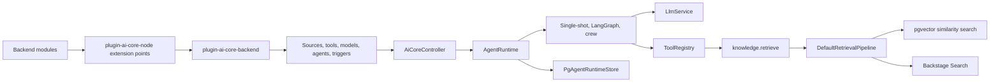

## Core Development

{: .no_toc }

This section documents the internal AI Core plugin stack used by AI Crew Suite. It is written for developers maintaining the core Backstage backend packages, adding provider modules, or changing the shared agent runtime contracts.

The core stack is intentionally split into a small contract package, one runtime plugin, and provider modules. That separation keeps domain agents, retrieval tools, model adapters, and persistence implementations replaceable without forcing the orchestrator loop to know about every provider.

## Package Map

| Package                                                               | Role                                                                                                               | Primary integration surface                                                                                         |
| --------------------------------------------------------------------- | ------------------------------------------------------------------------------------------------------------------ | ------------------------------------------------------------------------------------------------------------------- |
| `@webstackbuilders/plugin-ai-core-node`                               | Shared contracts and Backstage extension points.                                                                   | `sourceExtensionPoint`, `toolExtensionPoint`, `modelExtensionPoint`, `agentExtensionPoint`, `triggerExtensionPoint` |
| `@webstackbuilders/plugin-ai-core-backend`                            | Runtime plugin that registers extension points, resolves config, creates agents, and exposes HTTP/SSE routes.      | `ragAiPlugin`, `createAiBackendServices`, `AgentRuntime`, orchestrators                                             |
| `@webstackbuilders/plugin-ai-core-backend-module-retrieval-augmenter` | Default indexing and retrieval primitives for catalog, TechDocs, vector retrieval, and Backstage Search retrieval. | `DefaultVectorAugmentationIndexer`, `DefaultRetrievalPipeline`                                                      |
| `@webstackbuilders/plugin-ai-core-backend-module-pgvector`            | PostgreSQL storage for embeddings, sessions, runs, checkpoints, artifacts, approvals, and audit logs.              | `createPgVectorStore`, `createPgAgentRuntimeStore`                                                                  |
| `@webstackbuilders/plugin-ai-core-backend-module-aws`                 | AWS Bedrock embeddings module that contributes a retrieval/indexing tool.                                          | `aiCoreBackendModuleAws`, `BedrockAugmenter`                                                                        |
| `@webstackbuilders/plugin-ai-core-backend-module-openai`              | OpenAI embeddings module that contributes a retrieval/indexing tool.                                               | `aiCoreBackendModuleOpenAi`, `OpenAiAugmenter`                                                                      |
| `@webstackbuilders/plugin-ai-core-backend-module-openrouter`          | OpenRouter chat model module that contributes LangChain chat models.                                               | `aiCoreBackendModuleOpenRouter`, `createOpenRouterModels`                                                           |

## Runtime Topology



The `plugin-ai-core-node` package is the boundary package. It defines the portable types that modules share: sources, embedding documents, vector stores, retrieval pipelines, tools, model definitions, agent definitions, run stores, session stores, approval records, artifacts, audit logs, agent events, and orchestrators.

The `plugin-ai-core-backend` package is the owning runtime. It registers Backstage extension points, rejects duplicate source/tool/model/agent IDs at boot, builds the resolved service graph, creates the default tool registry, validates agent references, and mounts the API router. The runtime requires at least one registered model and at least one registered tool that exposes both an `augmentationIndexer` and a `retrievalPipeline`.

Provider modules are regular Backstage backend modules. They should register capabilities through extension points rather than manually calling backend factory functions. Embeddings modules usually register tools because they provide both indexing and retrieval dependencies. Model modules register `ModelDefinition` instances because agents reference models by stable `modelRef` IDs.

The runtime API is documented separately from orchestrators because it is the control plane for operating runs: route validation, SSE replay, trigger/webhook intake, approvals, rate limits, timeouts, and built-in tool-pack placeholders all live at the controller boundary.

## Extension Points

| Extension point     | Use it when                                                                                                            | Duplicate behavior                            |
| ------------------- | ---------------------------------------------------------------------------------------------------------------------- | --------------------------------------------- |
| `plugin-ai.source`  | A module introduces a logical retrieval/indexing source such as `catalog`, `tech-docs`, or an internal knowledge base. | Duplicate source IDs fail backend startup.    |
| `plugin-ai.tool`    | A module contributes a callable agent tool or the retrieval/indexing runtime dependency used by `knowledge.retrieve`.  | Duplicate tool IDs fail backend startup.      |
| `plugin-ai.model`   | A module contributes a LangChain `BaseLLM` or `BaseChatModel` for agent execution.                                     | Duplicate model IDs fail backend startup.     |
| `plugin-ai.agent`   | A module contributes an executable agent profile.                                                                      | Duplicate agent IDs fail backend startup.     |
| `plugin-ai.trigger` | A module binds external events or schedules to agent execution.                                                        | Triggers are collected in registration order. |

## Configuration Layers

The runtime reads its own defaults from the `ai` app-config object. The important core fields are:

```yaml
ai:
  supportedSources: ['catalog', 'tech-docs']
  defaults:
    model: openrouter-default
    agent: service-contextualizer
    systemPrompt: 'Use retrieved context before answering.'
  hardening:
    timeoutMs: 60000
    maxRetries: 1
    retryBackoffMs: 250
    maxTotalTokens: 20000
  prompts:
    prefix: 'Use the following documents as context.'
    suffix: 'Begin.'
```

Provider modules own provider-specific config. For example, embeddings providers read `ai.embeddings.*`, pgvector reads `ai.storage.pgVector`, and OpenRouter reads `ai.models.openrouter`.

## Development Workflow

Run package operations from the monorepo root so Yarn Plug'n'Play and project references resolve consistently.

```bash
yarn install --refresh
yarn workspace @webstackbuilders/plugin-ai-core-backend test
yarn tsc -b plugins/backend/plugin-ai-core-backend/tsconfig.json --noEmit
yarn typecheck:full
```

When changing a shared contract in `plugin-ai-core-node`, expect follow-up work in every backend module that implements that contract. When changing runtime behavior in `plugin-ai-core-backend`, prefer focused tests around `createAiBackendServices`, `AiCoreController`, `AgentRuntime`, and the affected orchestrator.

## Related Pages

- [Orchestrators & Agents](orchestrators.md) covers the runtime event loop, agent definitions, memory, approvals, and orchestrator responsibilities.
- [Runtime API & Operations](runtime-api.md) covers HTTP routes, structured SSE frames, run replay, triggers, webhooks, hardening limits, and built-in tool packs.
- [Ingestion Pipelines](ingestion-pipelines.md) covers indexing, chunking, source routing, retrieval, and post-processing.
- [LLM Providers](llm-providers.md) covers model registration and provider module expectations.
- [Embeddings & Vector Stores](embeddings-vectorstores.md) covers embeddings modules, pgvector storage, and runtime persistence.
