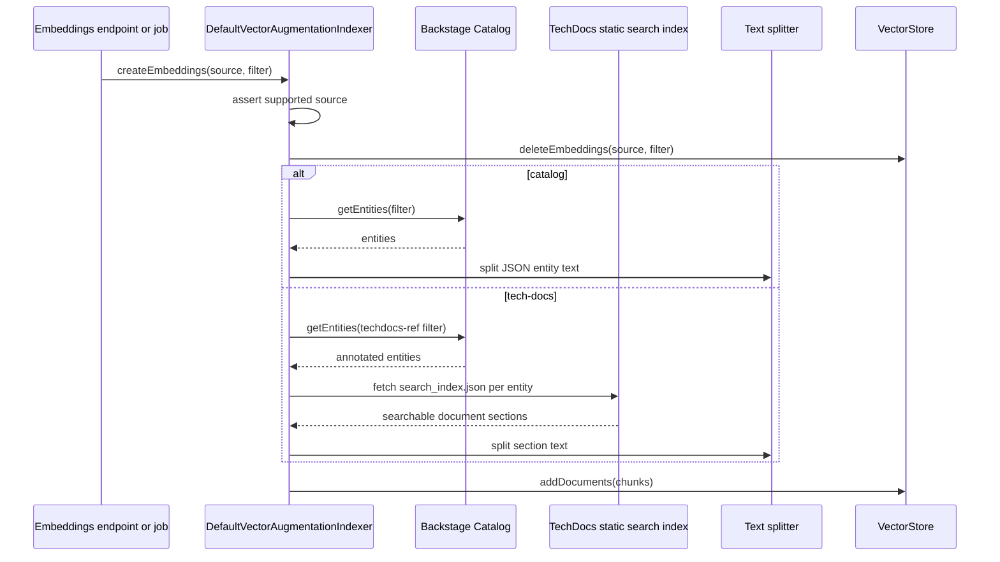

## Ingestion Pipelines

{: .no_toc }

The ingestion pipeline converts Backstage content into retrievable context for agent runs. In the current core stack, ingestion means creating embedding documents from catalog entities and TechDocs search indexes, chunking those documents, writing them through a vector store, and retrieving them later alongside Backstage Search results.

### Pipeline Components

| Component                          | Package                                             | Responsibility                                                                           |
| ---------------------------------- | --------------------------------------------------- | ---------------------------------------------------------------------------------------- |
| `DefaultVectorAugmentationIndexer` | `plugin-ai-core-backend-module-retrieval-augmenter` | Loads source content, chunks it, and writes embedding documents to a `VectorStore`.      |
| `DefaultRetrievalPipeline`         | `plugin-ai-core-backend-module-retrieval-augmenter` | Routes a query to retrievers, groups retriever output, and post-processes final context. |
| `SourceBasedRetrievalRouter`       | `plugin-ai-core-backend-module-retrieval-augmenter` | Selects retrievers for a source such as `catalog`, `tech-docs`, or `all`.                |
| `VectorEmbeddingsRetriever`        | `plugin-ai-core-backend-module-retrieval-augmenter` | Executes semantic similarity search over indexed vector documents.                       |
| `SearchRetriever`                  | `plugin-ai-core-backend-module-retrieval-augmenter` | Retrieves additional context from Backstage Search.                                      |
| `CombiningPostProcessor`           | `plugin-ai-core-backend-module-retrieval-augmenter` | Flattens grouped retriever results into the final augmentation context.                  |

### Indexing Flow



The default indexer supports `catalog` and `tech-docs`. It intentionally rejects unsupported sources before deletion so a bad indexing request cannot remove unrelated vectors. TechDocs search-index fetch failures are logged and skipped per entity; catalog/auth/vector-store failures propagate so callers can retry or mark the indexing job failed.

### Chunking Behavior

Chunking is handled by `RecursiveCharacterTextSplitter` from `@langchain/textsplitters`. The shared options are read by provider modules from `ai.embeddings` and passed into the indexer:

```yaml
ai:
  embeddings:
    chunkSize: 1000
    chunkOverlap: 200
    concurrencyLimit: 10
```

Use smaller chunks when answers need targeted facts or entity-level precision. Use larger chunks when the model needs more surrounding context and the embedding model has enough capacity. Any change to chunk size or overlap affects future indexed documents only; re-index affected sources after changing those values.

For tuning ranges by content type, overlap behavior, provider batch sizing, and the difference between text chunk size and vector dimensions, see [Embeddings & Vector Stores](embeddings-vectorstores.md).

### Retrieval Flow

```mermaid
flowchart LR
  Tool[knowledge.retrieve] --> Pipeline[DefaultRetrievalPipeline]
  Pipeline --> Router[SourceBasedRetrievalRouter]
  Router --> Vector[VectorEmbeddingsRetriever]
  Router --> Search[SearchRetriever]
  Vector --> Store[VectorStore.similaritySearch]
  Search --> BackstageSearch[Backstage Search API]
  Store --> Grouped[Grouped retriever outputs]
  BackstageSearch --> Grouped
  Grouped --> Post[CombiningPostProcessor]
  Post --> Context[EmbeddingDoc[]]
```

The default factory wires vector retrieval and Backstage Search retrieval for `catalog`, `tech-docs`, and `all`. Source-specific vector retrieval uses `{ source }` metadata filters, while the special `all` source omits the source filter and searches across all indexed documents.

`DefaultRetrievalPipeline` executes direct retrievers first, then routed retrievers. Results are grouped by retriever ID. If more than one retriever has the same ID, documents are merged instead of overwritten so a registration mistake does not silently discard context.

### Backstage Search Integration

`SearchRetriever` delegates HTTP and auth behavior to `SearchClient`. The client discovers the Backstage Search base URL, requests plugin-to-plugin credentials through `AuthService`, and queries the search endpoint with URL-safe parameters.

The `all` source does not add a search type filter. Source-specific requests add the source/type filter where supported. Non-OK search responses are logged and return an empty result set; unexpected client failures are logged and re-thrown.

### Source Registration

The backend resolves sources from two places:

- Modules can register descriptors through `sourceExtensionPoint`.
- Config can list supported source IDs under `ai.supportedSources`.

If config omits `supportedSources`, the backend registers `catalog` by default. Registering a source descriptor is separate from implementing indexing or retrieval for that source. New sources usually need all of the following:

- A `SourceDescriptor` registration.
- An indexer path that can turn the source into `EmbeddingDoc` values.
- A retriever or router mapping for query-time context.
- Tests for indexing, retrieval, deletion, and unsupported-source behavior.

### Embeddings Endpoint Behavior

The core backend exposes embedding creation and deletion through controller/router paths. Historically the endpoint was mounted as `/embeddings/:source` under the plugin route. The important runtime rule is unchanged: indexing is explicit and should be triggered by jobs, events, or developer workflows rather than automatically on every run.

This explicit indexing model protects provider budgets. Catalog and TechDocs can produce many chunks, and each chunk can result in paid embedding calls. Prefer event-driven indexing when content changes, with scheduled backfills only when the cost profile is understood.

### Change Checklist

When changing ingestion or retrieval behavior:

- Add tests for the specific source, retriever, router, post-processor, or indexer path.
- Verify delete-before-write behavior cannot delete unsupported sources.
- Keep source IDs stable; changing them invalidates metadata filters for existing vectors.
- Re-index affected sources after changing chunking, metadata mapping, or embedding dimensions.
- Update [Embeddings & Vector Stores](embeddings-vectorstores.md) if vector store filters, dimensions, or persistence semantics change.
- Update [Orchestrators & Agents](orchestrators.md) if `knowledge.retrieve` inputs or output shape change.
