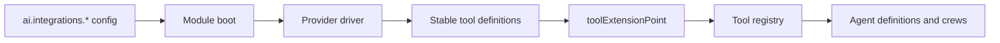

## Integration Modules

{: .no_toc }

Integration modules register stable, provider-neutral AI tools that let agents gather context from and act on external systems. Each module covers a capability boundary—source control, collaboration, observability, compliance, cloud infrastructure, or quality scorecards—and hides vendor-specific API calls behind a shared driver interface.

These modules are the primary way agentic workflow plugins access external systems without depending on provider SDKs directly. Agent definitions reference tools by stable ID, and the module selected through configuration decides whether a call goes to GitHub, Jira, PagerDuty, OPA, AWS, or Soundcheck.

### Module Map

| Module                                             | Capability boundary                                                                         | Example providers                                                       |
| -------------------------------------------------- | ------------------------------------------------------------------------------------------- | ----------------------------------------------------------------------- |
| `plugin-ai-core-backend-module-vcs`                | Source control, repository reading, branches, commits, pull requests, code review metadata. | GitHub, GitLab, Bitbucket, Azure DevOps, Backstage `urlReader`.         |
| `plugin-ai-core-backend-module-collaboration`      | Human communication, ticketing, work coordination, notifications.                           | Slack, Microsoft Teams, Jira, Linear.                                   |
| `plugin-ai-core-backend-module-observability`      | Runtime signals, incidents, alerts, metrics, logs, traces.                                  | PagerDuty, Opsgenie, Datadog, New Relic, Splunk, OpenTelemetry, Jaeger. |
| `plugin-ai-core-backend-module-compliance`         | Policy, permission, governance, FinOps and security validation.                             | OPA/Rego, Backstage permission policies, static policy registries.      |
| `plugin-ai-core-backend-module-cloud-providers`    | Cloud resource lookup, infrastructure context, account/project/subscription metadata.       | AWS, Azure, GCP, Kubernetes infrastructure inventory.                   |
| `plugin-ai-core-backend-module-quality-scorecards` | Service health, scorecards, ownership quality, maturity signals.                            | Soundcheck, Scorecards, Tech Radar, catalog annotations.                |

### Architecture



Every integration module follows the same boot sequence:

1. Read category config from `coreServices.rootConfig` under `ai.integrations.*`.
2. Build one or more provider drivers from the selected provider.
3. Register stable AI tools with `toolExtensionPoint`.
4. Keep all provider-specific auth, API clients, retries, pagination, and response normalization inside the module.
5. Return compact, serializable tool results suitable for `tool_result` events and artifact persistence.

The core runtime stays blind to vendor SDKs. Agents depend on stable tool IDs. Provider drivers inside a module decide whether a call goes to GitHub, GitLab, Jira, PagerDuty, OPA, AWS, Azure, GCP, or an internal system.

### Tool Contract

Integration tools use the existing AI Core `Tool` contract from `plugin-ai-core-node`:

```typescript
import type { Tool } from '@webstackbuilders/plugin-ai-core-node';

export const exampleTool: Tool = {
  id: 'vcs.pull_request.open',
  description: 'Open a pull request for a proposed repository change',
  effect: 'write',
  schema: undefined,
  async invoke(args, ctx) {
    // Resolve driver from module config and use ctx.logger, ctx.identity,
    // ctx.runId, and ctx.signal for observability and cancellation.
  },
};
```

Tool IDs follow the shape `<domain>.<resource-or-context>.<verb>`:

- `vcs.repository.read_file`
- `collaboration.ticket.search`
- `observability.incident.list_active`
- `compliance.policy.evaluate`
- `cloud.resource.lookup`
- `quality.scorecard.get`

Use `effect: 'read'` for context-gathering tools and `effect: 'write'` for tools that mutate external systems. Write tools must be designed for human-in-the-loop approval and audit logging.

### Provider Driver Pattern

Each module exposes a small internal driver interface and one or more provider implementations.

```
src/
  module.ts
  tools/
    registerTools.ts
  providers/
    types.ts
    github.ts
    gitlab.ts
  config.ts
  __tests__/
```

The module boot sequence reads config, builds a driver, and registers tools. Tools are intentionally thin wrappers around the driver so agent definitions can depend on stable tool IDs while provider selection stays in the module boot sequence.

### Configuration

All integration modules use one top-level config namespace under the existing `ai` key:

```yaml
ai:
  integrations:
    vcs:
      provider: github
      github:
        host: github.com
    collaboration:
      ticketing: jira
      messaging: slack
    observability:
      alerting: pagerduty
      metrics: datadog
      traces: opentelemetry
    compliance:
      policy: opa
      opa:
        baseUrl: http://localhost:8181
    cloudProviders:
      defaultProvider: aws
      aws:
        region: us-east-1
    qualityScorecards:
      provider: soundcheck
```

Each module owns its config schema in its package `config.d.ts`. Secrets should continue to flow through environment variables, Backstage integrations, or host-specific credential managers rather than hardcoded config literals.

### Using Integration Tools in Agents

Agent definitions reference integration tools by their stable IDs through `toolIds`:

```typescript
const prReviewerAgent: AgentDefinition = {
  id: 'pr-reviewer',
  modelRef: 'openrouter-default',
  systemPrompt:
    'Review pull requests using repository context and quality signals.',
  toolIds: [
    'vcs.repository.read_file',
    'vcs.pull_request.list',
    'quality.scorecard.get',
    'compliance.policy.evaluate',
    'knowledge.retrieve',
  ],
};
```

For crew orchestrators, individual roles can override the tool allow-list:

```typescript
const incidentCrew: AgentDefinition = {
  id: 'incident-responder',
  modelRef: 'openrouter-default',
  systemPrompt:
    'Coordinate incident response across observability and collaboration systems.',
  toolIds: [],
  orchestrator: 'crew',
  crew: {
    roles: [
      {
        id: 'triager',
        systemPrompt: 'Gather incident context and active alerts.',
        toolIds: [
          'observability.incident.list_active',
          'observability.alert.history',
        ],
      },
      {
        id: 'communicator',
        systemPrompt: 'Post incident summaries to the on-call channel.',
        toolIds: ['collaboration.channel.lookup', 'collaboration.message.post'],
      },
    ],
  },
};
```

The backend validates every tool reference after all modules and config-defined agents are resolved. Unknown tool IDs fail startup instead of producing a partially wired runtime.

---

## VCS Module

The VCS module provides repository context and code-change writeback tools. It registers stable, provider-neutral repository and pull request tools while hiding vendor-specific API calls behind a `VcsDriver` interface.

### Registered Tools

| Tool ID                       | Effect | Purpose                                                                           |
| ----------------------------- | ------ | --------------------------------------------------------------------------------- |
| `vcs.repository.get_metadata` | `read` | Return repo default branch, provider, URL, owner, and visibility where available. |
| `vcs.repository.read_file`    | `read` | Read a file from a repository by URL, path, and optional ref.                     |
| `vcs.repository.search`       | `read` | Search repository content or metadata when the provider supports it.              |
| `vcs.pull_request.list`       | `read` | Return active pull requests for a repository.                                     |

### Configuration

```yaml
ai:
  integrations:
    vcs:
      provider: github
      github:
        host: github.com
        apiBaseUrl: https://api.github.com
```

Supported providers: `github`, `gitlab`, `bitbucket`, `azuredevops`. Only `github` is implemented in the first pass.

### GitHub Driver

The GitHub driver delegates file reads to the Backstage `UrlReaderService` so credentials and host integrations are resolved through Backstage integrations config rather than a dedicated GitHub SDK. Pull request and search operations are stubbed in the first pass and will be wired to the GitHub REST API in a later phase.

### Adding a VCS Provider

Create a new driver implementation that satisfies the `VcsDriver` interface and add a case to the module's provider switch statement. The driver should normalize provider-specific responses into the shared `RepositoryMetadata`, `PullRequestSummary`, and `RepositorySearchResult` types.

---

## Collaboration Module

The collaboration module provides work coordination and human communication tools. It registers stable, provider-neutral ticketing and messaging tools while hiding vendor-specific API calls behind a `CollaborationDriver` interface.

### Registered Tools

| Tool ID                        | Effect  | Purpose                                                        |
| ------------------------------ | ------- | -------------------------------------------------------------- |
| `collaboration.ticket.search`  | `read`  | Search tickets by query, service, team, or incident reference. |
| `collaboration.ticket.get`     | `read`  | Fetch ticket details and linked discussions.                   |
| `collaboration.channel.lookup` | `read`  | Resolve a team or service to a messaging channel.              |
| `collaboration.ticket.create`  | `write` | Create a ticket from an agent artifact.                        |
| `collaboration.ticket.comment` | `write` | Add a comment with trace/run links to a ticket.                |
| `collaboration.message.post`   | `write` | Post a summary message to a messaging channel.                 |

### Configuration

```yaml
ai:
  integrations:
    collaboration:
      ticketing: jira
      messaging: slack
      ticketingProviders:
        jira:
          baseUrl: https://my-org.atlassian.net
      messagingProviders:
        slack:
          baseUrl: https://my-org.slack.com
```

Supported ticketing providers: `jira`, `linear`. Supported messaging providers: `slack`, `teams`. Only `jira` and `slack` are implemented in the first pass.

### Driver Separation

Ticketing and messaging live in one collaboration module because they share human workflow semantics. The module builds separate drivers for ticketing and messaging so a ticket search call goes to Jira while a message post goes to Slack. If chat/messaging grows into interactive bot behavior, split messaging into a dedicated module later.

---

## Observability Module

The observability module provides runtime signals and incident context tools. It registers stable, provider-neutral incident, alert, metrics, logs, and traces tools while hiding vendor-specific API calls behind an `ObservabilityDriver` interface.

### Registered Tools

| Tool ID                              | Effect  | Purpose                                                          |
| ------------------------------------ | ------- | ---------------------------------------------------------------- |
| `observability.incident.list_active` | `read`  | List active incidents for a service, team, or escalation policy. |
| `observability.alert.history`        | `read`  | Return alert history and noise patterns for a service.           |
| `observability.metrics.query`        | `read`  | Query metrics over a bounded time window.                        |
| `observability.logs.search`          | `read`  | Search logs around a time range and entity.                      |
| `observability.traces.search`        | `read`  | Search traces by service, operation, or error signature.         |
| `observability.incident.annotate`    | `write` | Add a diagnostic note or run link to an incident.                |
| `observability.alert.suggest_tuning` | `read`  | Produce a provider-normalized alert tuning artifact.             |

### Configuration

```yaml
ai:
  integrations:
    observability:
      alerting: pagerduty
      metrics: datadog
      traces: opentelemetry
      alertingProviders:
        pagerduty:
          baseUrl: https://events.pagerduty.com
```

Supported alerting providers: `pagerduty`, `opsgenie`. Supported metrics providers: `datadog`, `newrelic`, `prometheus`. Supported traces providers: `opentelemetry`, `jaeger`. Only `pagerduty` is implemented in the first pass; metrics and traces use stub drivers.

### Driver Separation

The module builds separate drivers for alerting, metrics, and traces so an incident listing goes to PagerDuty while a metrics query goes to Datadog. PagerDuty and Opsgenie belong here because they are incident/on-call systems, even though they also notify humans. OpenTelemetry and Jaeger start as trace/query drivers, not model-provider concerns.

---

## Compliance Module

The compliance module provides policy evaluation, permission checks, and governance feedback tools. It registers stable, provider-neutral policy, permission, architecture, and cost tools while hiding vendor-specific API calls behind a `ComplianceDriver` interface.

### Registered Tools

| Tool ID                            | Effect | Purpose                                                                     |
| ---------------------------------- | ------ | --------------------------------------------------------------------------- |
| `compliance.policy.evaluate`       | `read` | Evaluate generated IaC, config, or proposed actions against policy bundles. |
| `compliance.permission.check`      | `read` | Ask whether the triggering user can perform a requested class of action.    |
| `compliance.architecture.validate` | `read` | Validate proposed architecture against internal static constraints.         |
| `compliance.cost.estimate`         | `read` | Estimate or classify cost impact from a governance/FinOps system.           |

### Configuration

```yaml
ai:
  integrations:
    compliance:
      policy: opa
      opa:
        baseUrl: http://localhost:8181
      staticPolicies:
        path: ./config/ai-policies.yaml
```

Supported policy providers: `opa`, `static`. Only `opa` is implemented in the first pass.

### Boundary with Cloud Providers

Keep policy evaluation separate from cloud inventory. Compliance answers whether an action is allowed, not how to perform the action. Compliance can call cloud-provider tools through agents if it needs resource context. Cost estimation starts here; if it becomes provider inventory-heavy, split `cost` into cloud providers later.

---

## Cloud Providers Module

The cloud providers module provides cloud inventory, ownership, and infrastructure context tools. It registers stable, provider-neutral account, resource, dependency, and Kubernetes workload tools while hiding vendor-specific API calls behind a `CloudProviderDriver` interface.

### Registered Tools

| Tool ID                       | Effect | Purpose                                                             |
| ----------------------------- | ------ | ------------------------------------------------------------------- |
| `cloud.account.lookup`        | `read` | Resolve cloud account/project/subscription metadata.                |
| `cloud.resource.lookup`       | `read` | Find existing resources by service, tags, owner, or catalog entity. |
| `cloud.resource.dependencies` | `read` | Return cloud dependencies around a service.                         |
| `cloud.kubernetes.workloads`  | `read` | Inspect Kubernetes workloads for deployed infrastructure state.     |

### Configuration

```yaml
ai:
  integrations:
    cloudProviders:
      defaultProvider: aws
      aws:
        region: us-east-1
```

Supported providers: `aws`, `azure`, `gcp`. Only `aws` is implemented in the first pass.

### Write Tools

Direct cloud mutation tools are deferred until there is a specific approved agent workflow. Most first-pass cloud tools are read-only. Kubernetes starts here for workload inventory; if Kubernetes remediation grows large, split it later.

---

## Quality Scorecards Module

The quality scorecards module provides service quality, standards, maturity, and readiness tools. It registers stable, provider-neutral scorecard, checks, tech radar, and service profile tools while hiding vendor-specific API calls behind a `QualityScorecardDriver` interface.

### Registered Tools

| Tool ID                       | Effect | Purpose                                                                        |
| ----------------------------- | ------ | ------------------------------------------------------------------------------ |
| `quality.scorecard.get`       | `read` | Fetch scorecard or Soundcheck results for an entity.                           |
| `quality.checks.list`         | `read` | Return failed checks and metadata for an entity.                               |
| `quality.tech_radar.lookup`   | `read` | Resolve approved technologies or lifecycle status.                             |
| `quality.service_profile.get` | `read` | Compose catalog metadata, ownership, scorecards, and standards into a profile. |

### Configuration

```yaml
ai:
  integrations:
    qualityScorecards:
      provider: soundcheck
      soundcheck:
        baseUrl: https://soundcheck.example.com
```

Supported providers: `soundcheck`, `scorecards`, `internal`. Only `soundcheck` is implemented in the first pass.

### Boundary with Compliance

Keep quality scorecards separate from compliance. Compliance answers allowed/not allowed; quality scorecards answer health, maturity, and improvement opportunities. Tech Radar belongs here unless it is used strictly as a policy enforcement source.

---

## Workflow Composition

The six modules cover known workflow ideas without requiring one package per vendor. When building agentic workflow plugins, combine tools from multiple modules:

| Workflow idea             | Modules involved                                                         |
| ------------------------- | ------------------------------------------------------------------------ |
| PR reviewer               | VCS, quality scorecards, compliance, `knowledge.retrieve`                |
| Incident responder        | Observability, collaboration, VCS, cloud providers, `knowledge.retrieve` |
| Alert tuner               | Observability, compliance, VCS, collaboration                            |
| Release notes generator   | VCS, collaboration, quality scorecards                                   |
| Scaffolder drift detector | VCS, cloud providers, compliance, quality scorecards                     |
| Tech debt scout           | Quality scorecards, VCS, observability, `knowledge.retrieve`             |
| Security remediation      | Compliance, VCS, cloud providers, collaboration, HITL approvals          |
| Cost crew                 | Cloud providers, compliance, quality scorecards, collaboration           |

---

## Adding a New Integration Module

Do not scaffold additional modules until a real workflow forces a capability that does not naturally fit the six existing boundaries. The six groups are broad enough for the immediate agent ideas and avoid premature package sprawl.

When a new capability boundary is justified:

1. Create a backend module with `pluginId: 'ai-core'` and a descriptive `moduleId`.
2. Add a direct dependency on `@webstackbuilders/plugin-ai-core-node`.
3. Define a provider-neutral driver interface in `providers/types.ts`.
4. Add a `config.ts` helper for provider selection and validation.
5. Add `tools/registerTools.ts` to keep module boot thin.
6. Register stable tools through `toolExtensionPoint`.
7. Add unit tests for config validation, driver selection, and tool invocation.
8. Own the config schema in the package `config.d.ts` under `ai.integrations.*`.

Prefer Backstage platform services where they already solve auth or discovery:

- Use `coreServices.urlReader` for repository file reads before adding direct VCS SDK reads.
- Use Catalog APIs for entity ownership, systems, resources, and relations.
- Use Backstage permissions for user capability checks before write operations.
- Use Backstage integrations config for provider host credentials where applicable.

---

## Change Checklist

When changing integration module behavior:

- Keep tool IDs stable or document migration steps for agent definitions that reference them.
- Validate provider config before constructing drivers so module boot fails early with an actionable error.
- Add tests for config validation, driver selection, tool invocation, and registration.
- Keep provider-specific auth, API clients, retries, and pagination inside the module.
- Return compact, serializable tool results suitable for `tool_result` events and artifact persistence.
- Update this document when adding new tools, changing tool IDs, or introducing new provider drivers.
- Update [Orchestrators & Agents](orchestrators.md) if tool execution semantics or approval behavior change.
- Update [Runtime API & Operations](runtime-api.md) if built-in tool packs are replaced by integration module tools.
