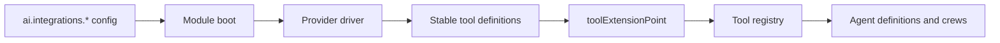

## Integration Modules

{: .no_toc }

Integration modules register stable, provider-neutral AI tools that let agents gather context from and act on external systems. Each module covers a capability boundary—source control, project management, communication, incident management, observability, compliance, cloud infrastructure, or quality scorecards—and hides vendor-specific API calls behind a shared driver interface.

These modules are the primary way agentic workflow plugins access external systems without depending on provider SDKs directly. Agent definitions reference tools by stable ID, and the module selected through configuration decides whether a call goes to GitHub, Jira, PagerDuty, OPA, AWS, or Soundcheck.

### Module Map

| Module                                              | Capability boundary                                                                         | Example providers                                                  |
| --------------------------------------------------- | ------------------------------------------------------------------------------------------- | ------------------------------------------------------------------ |
| `plugin-ai-core-backend-module-vcs`                 | Source control, repository reading, branches, commits, pull requests, code review metadata. | GitHub, GitLab, Bitbucket, Azure DevOps, Backstage `urlReader`.    |
| `plugin-ai-core-backend-module-project-management`  | Transactional work tracking, tickets, epics, delivery workflow.                             | Jira, Linear, Asana, GitHub Projects, GitLab Issues.               |
| `plugin-ai-core-backend-module-communication`       | Real-time chat, notifications, human-in-the-loop approvals.                                 | Slack, Microsoft Teams.                                            |
| `plugin-ai-core-backend-module-incident-management` | On-call schedules, paging, alert routing, incident lifecycles.                              | PagerDuty, Opsgenie, incident.io.                                  |
| `plugin-ai-core-backend-module-observability`       | Metrics, logs, traces, dashboards.                                                          | Datadog, New Relic, Splunk, Prometheus, OpenTelemetry, Jaeger.     |
| `plugin-ai-core-backend-module-compliance`          | Policy, permission, governance, FinOps and security validation.                             | OPA/Rego, Backstage permission policies, static policy registries. |
| `plugin-ai-core-backend-module-cloud-providers`     | Cloud resource lookup, infrastructure context, account/project/subscription metadata.       | AWS, Azure, GCP, Kubernetes infrastructure inventory.              |
| `plugin-ai-core-backend-module-quality-scorecards`  | Service health, scorecards, ownership quality, maturity signals.                            | Soundcheck, Scorecards, Tech Radar, catalog annotations.           |

### Architecture


```mermaid
flowchart LR
  Config[ai.integrations.* config] --> Module[Module boot]
  Module --> Driver[Provider driver]
  Driver --> Tools[Stable tool definitions]
  Tools --> EP[toolExtensionPoint]
  EP --> Registry[Tool registry]
  Registry --> Agents[Agent definitions and crews]
```

Every integration module follows the same boot sequence:

1. Read category config from `coreServices.rootConfig` under `ai.integrations.*`.
2. Build one or more provider drivers from the selected provider.
3. Register stable AI tools with `toolExtensionPoint`.
4. Keep all provider-specific auth, API clients, retries, pagination, and response normalization inside the module.
5. Return compact, serializable tool results suitable for `tool_result` events and artifact persistence.

The core runtime stays blind to vendor SDKs. Agents depend on stable tool IDs. Provider drivers inside a module decide whether a call goes to GitHub, GitLab, Jira, PagerDuty, OPA, AWS, Azure, GCP, or an internal system.

### Tool Contract

Integration tools use the existing AI Core `Tool` contract from `plugin-ai-core-node`:

```typescript
import type { Tool } from '@webstackbuilders/plugin-ai-core-node';

export const exampleTool: Tool = {
  id: 'vcs.pull_request.open',
  description: 'Open a pull request for a proposed repository change',
  effect: 'write',
  schema: undefined,
  async invoke(args, ctx) {
    // Resolve driver from module config and use ctx.logger, ctx.identity,
    // ctx.runId, and ctx.signal for observability and cancellation.
  },
};
```

Tool IDs follow the shape `<domain>.<resource-or-context>.<verb>`:

- `vcs.repository.read_file`
- `project.ticket.search`
- `incident.oncall.get`
- `observability.logs.search`
- `compliance.policy.evaluate`
- `cloud.resource.lookup`
- `quality.scorecard.get`

Use `effect: 'read'` for context-gathering tools and `effect: 'write'` for tools that mutate external systems. Write tools must be designed for human-in-the-loop approval and audit logging.

### Provider Driver Pattern

An integration group is split into a **core module** that owns the driver interface, extension point, config selector, and tool registration, plus one **sibling driver module per third-party service** that owns the vendor SDK, credentials, and response mapping. The core module never imports vendor code.

```
plugin-ai-core-backend-module-<group>/          # core
  src/
    module.ts          # registers the extension point and resolves the driver
    tools/
      registerTools.ts # thin wrappers over the driver interface
    config.ts          # reads the driver selector only
  config.d.ts

plugin-ai-core-backend-module-<group>-<provider>/   # sibling
  src/
    module.ts          # deps on the extension point, calls registerDriver
    providers/
      <Provider>Driver.ts
    config.ts          # reads ai.integrations.<group>.<provider>
  config.d.ts
```

Driver interfaces and their extension points live in `@webstackbuilders/plugin-ai-core-node` so both sides of the boundary import the same contract without a circular dependency.

The core module boot sequence reads config, resolves the driver registered under that identifier, and registers tools. Boot fails with an explicit error when the selected identifier has no registered driver. Tools are intentionally thin wrappers around the driver so agent definitions can depend on stable tool IDs while provider selection stays in configuration.

### Configuration

All integration modules use one top-level config namespace under the existing `ai` key:

```yaml
ai:
  integrations:
    vcs:
      provider: github
      github:
        host: github.com
    projectManagement:
      provider: jira
    communication:
      provider: slack
    incidentManagement:
      provider: pagerduty
    observability:
      provider: datadog
    compliance:
      provider: opa
    cloudProviders:
      defaultProvider: aws
      aws:
        region: us-east-1
    qualityScorecards:
      provider: soundcheck
```

Each module owns its config schema in its package `config.d.ts`. Secrets should continue to flow through environment variables, Backstage integrations, or host-specific credential managers rather than hardcoded config literals.

### Using Integration Tools in Agents

Agent definitions reference integration tools by their stable IDs through `toolIds`:

```typescript
const prReviewerAgent: AgentDefinition = {
  id: 'pr-reviewer',
  modelRef: 'openrouter-default',
  systemPrompt:
    'Review pull requests using repository context and quality signals.',
  toolIds: [
    'vcs.repository.read_file',
    'vcs.pull_request.list',
    'quality.scorecard.get',
    'compliance.policy.evaluate',
    'knowledge.retrieve',
  ],
};
```

For crew orchestrators, individual roles can override the tool allow-list:

```typescript
const incidentCrew: AgentDefinition = {
  id: 'incident-responder',
  modelRef: 'openrouter-default',
  systemPrompt:
    'Coordinate incident response across incident management, observability, and communication systems.',
  toolIds: [],
  orchestrator: 'crew',
  crew: {
    roles: [
      {
        id: 'triager',
        systemPrompt: 'Gather incident context and active alerts.',
        toolIds: [
          'incident.incident.list',
          'incident.alert.history',
          'observability.logs.search',
        ],
      },
      {
        id: 'communicator',
        systemPrompt: 'Post incident summaries to the on-call channel.',
        toolIds: ['communication.channel.lookup', 'communication.message.post'],
      },
    ],
  },
};
```

The backend validates every tool reference after all modules and config-defined agents are resolved. Unknown tool IDs fail startup instead of producing a partially wired runtime.

---

## VCS Module

The VCS module provides repository context and code-change writeback tools. It registers stable, provider-neutral repository and pull request tools while hiding vendor-specific API calls behind a `VcsDriver` interface.

### Registered Tools

| Tool ID                       | Effect | Purpose                                                                           |
| ----------------------------- | ------ | --------------------------------------------------------------------------------- |
| `vcs.repository.get_metadata` | `read` | Return repo default branch, provider, URL, owner, and visibility where available. |
| `vcs.repository.read_file`    | `read` | Read a file from a repository by URL, path, and optional ref.                     |
| `vcs.repository.search`       | `read` | Search repository content or metadata when the provider supports it.              |
| `vcs.pull_request.list`       | `read` | Return active pull requests for a repository.                                     |

### Configuration

```yaml
ai:
  integrations:
    vcs:
      provider: github
      github:
        host: github.com
        apiBaseUrl: https://api.github.com
```

Supported providers: `github`, `gitlab`, `bitbucket`, `azuredevops`. Only `github` is implemented in the first pass.

### GitHub Driver

The GitHub driver delegates file reads to the Backstage `UrlReaderService` so credentials and host integrations are resolved through Backstage integrations config rather than a dedicated GitHub SDK. Pull request and search operations are stubbed in the first pass and will be wired to the GitHub REST API in a later phase.

### Adding a VCS Provider

Create `plugin-ai-core-backend-module-vcs-<provider>`, implement the `VcsDriver` interface from `@webstackbuilders/plugin-ai-core-node`, depend on `vcsDriversExtensionPoint` in `createBackendModule`, and call `registerDriver` during `init`. The driver should normalize provider-specific responses into the shared `RepositoryMetadata`, `PullRequestSummary`, and `RepositorySearchResult` types.

---

## Project Management Module

Transactional work tracking: tickets, epics, and software delivery workflow. Like the VCS and quality scorecards groups, it is split into a core module that owns the contract and tool surface, plus one sibling module per third-party service.

| Package                                                 | Role                                                  |
| ------------------------------------------------------- | ----------------------------------------------------- |
| `plugin-ai-core-backend-module-project-management`      | Extension point, driver resolution, tool registration |
| `plugin-ai-core-backend-module-project-management-jira` | `ProjectManagementDriver` for Jira Cloud              |

### Registered Tools

| Tool ID                  | Effect  | Purpose                                                  |
| ------------------------ | ------- | -------------------------------------------------------- |
| `project.ticket.search`  | `read`  | Search tickets by text, team, assignee, state, or label. |
| `project.ticket.get`     | `read`  | Fetch ticket details, comments, and assignee history.    |
| `project.ticket.create`  | `write` | Create a ticket from an agent artifact.                  |
| `project.ticket.comment` | `write` | Add a comment with trace/run links to a ticket.          |

### Configuration

```yaml
ai:
  integrations:
    projectManagement:
      provider: jira
      jira:
        baseUrl: https://my-org.atlassian.net
        email: ${JIRA_EMAIL}
        apiToken: ${JIRA_API_TOKEN}
        defaultProjectKey: OPS
```

### Adding a Provider

Create `plugin-ai-core-backend-module-project-management-<provider>`, implement `ProjectManagementDriver` from `@webstackbuilders/plugin-ai-core-node`, depend on `projectManagementDriversExtensionPoint` in `createBackendModule`, call `registerDriver` during `init`, and own `ai.integrations.projectManagement.<provider>` in the package's `config.d.ts`.

---

## Communication Module

Real-time chat, notifications, and human-in-the-loop approvals.

| Package                                             | Role                                                  |
| --------------------------------------------------- | ----------------------------------------------------- |
| `plugin-ai-core-backend-module-communication`       | Extension point, driver resolution, tool registration |
| `plugin-ai-core-backend-module-communication-slack` | `CommunicationDriver` for Slack                       |

### Registered Tools

| Tool ID                         | Effect  | Purpose                                                |
| ------------------------------- | ------- | ------------------------------------------------------ |
| `communication.channel.lookup`  | `read`  | Resolve a team or service to a chat channel.           |
| `communication.channel.history` | `read`  | Read back a channel or thread transcript.              |
| `communication.message.post`    | `write` | Post a summary, handover, or approval request message. |

### Configuration

```yaml
ai:
  integrations:
    communication:
      provider: slack
      slack:
        token: ${SLACK_BOT_TOKEN}
        workspaceDomain: my-org.slack.com
```

### Adding a Provider

Create `plugin-ai-core-backend-module-communication-<provider>`, implement `CommunicationDriver` from `@webstackbuilders/plugin-ai-core-node`, depend on `communicationDriversExtensionPoint` in `createBackendModule`, call `registerDriver` during `init`, and own `ai.integrations.communication.<provider>` in the package's `config.d.ts`.

---

## Incident Management Module

On-call schedules, alert routing, paging metadata, and incident lifecycles.

| Package                                                       | Role                                                  |
| ------------------------------------------------------------- | ----------------------------------------------------- |
| `plugin-ai-core-backend-module-incident-management`           | Extension point, driver resolution, tool registration |
| `plugin-ai-core-backend-module-incident-management-pagerduty` | `IncidentManagementDriver` for PagerDuty              |

### Registered Tools

| Tool ID                      | Effect  | Purpose                                                         |
| ---------------------------- | ------- | --------------------------------------------------------------- |
| `incident.incident.list`     | `read`  | List incidents by service, team, state, and time window.        |
| `incident.incident.get`      | `read`  | Fetch an incident with its timeline, responders, and notes.     |
| `incident.oncall.get`        | `read`  | Resolve who is currently on call.                               |
| `incident.alert.history`     | `read`  | Return alert firing history with trigger/resolution timestamps. |
| `incident.incident.annotate` | `write` | Add a diagnostic note or run link to an incident.               |

### Configuration

```yaml
ai:
  integrations:
    incidentManagement:
      provider: pagerduty
      pagerduty:
        apiToken: ${PAGERDUTY_API_TOKEN}
        fromEmail: ai-crew-suite@my-org.com
```

### Adding a Provider

Create `plugin-ai-core-backend-module-incident-management-<provider>`, implement `IncidentManagementDriver` from `@webstackbuilders/plugin-ai-core-node`, depend on `incidentManagementDriversExtensionPoint` in `createBackendModule`, call `registerDriver` during `init`, and own `ai.integrations.incidentManagement.<provider>` in the package's `config.d.ts`.

---

## Observability Module

Metrics, logs, traces, and dashboards from telemetry platforms.

| Package                                               | Role                                                  |
| ----------------------------------------------------- | ----------------------------------------------------- |
| `plugin-ai-core-backend-module-observability`         | Extension point, driver resolution, tool registration |
| `plugin-ai-core-backend-module-observability-datadog` | `ObservabilityDriver` for Datadog                     |

### Registered Tools

| Tool ID                        | Effect | Purpose                                                        |
| ------------------------------ | ------ | -------------------------------------------------------------- |
| `observability.metrics.query`  | `read` | Run a provider-native metric query over a bounded window.      |
| `observability.logs.search`    | `read` | Search logs by service, severity, and time window.             |
| `observability.traces.search`  | `read` | Search spans by service, operation, error status, or duration. |
| `observability.dashboard.list` | `read` | List provider-hosted dashboards for a service or team.         |

Every tool in this group is `read`. Telemetry platforms are a source of evidence for agents, never a target for autonomous writes.

### Configuration

```yaml
ai:
  integrations:
    observability:
      provider: datadog
      datadog:
        apiKey: ${DATADOG_API_KEY}
        applicationKey: ${DATADOG_APP_KEY}
```

### Adding a Provider

Create `plugin-ai-core-backend-module-observability-<provider>`, implement `ObservabilityDriver` from `@webstackbuilders/plugin-ai-core-node`, depend on `observabilityDriversExtensionPoint` in `createBackendModule`, call `registerDriver` during `init`, and own `ai.integrations.observability.<provider>` in the package's `config.d.ts`. A driver that only serves part of the contract, for example a Prometheus driver with no dashboard API, should return an empty result rather than throwing, so agents degrade gracefully.

---

## Why Four Groups Instead of Two

An integration group exists so a user configures and authenticates with exactly the services they use. Grouping unlike services forces a driver to implement methods it cannot support, which is how stub methods that throw or silently return empty arrays get written.

Ticket management and chat share "human workflow" semantics but nothing else: a Jira driver has no channels and a Slack driver has no tickets. Paging and telemetry share "runtime signals" but nothing else: PagerDuty has no trace spans and Datadog has no escalation policies. Each of the four groups now has exactly one driver interface, and every method on that interface is implementable by every provider in the group.

---

## Compliance Module

The compliance module provides policy evaluation, permission checks, and governance feedback tools. Like the VCS and quality scorecards groups, it is split into a core module that owns the contract and tool surface, plus one sibling module per third-party service.

| Package                                        | Role                                                  |
| ---------------------------------------------- | ----------------------------------------------------- |
| `plugin-ai-core-backend-module-compliance`     | Extension point, driver resolution, tool registration |
| `plugin-ai-core-backend-module-compliance-opa` | `ComplianceDriver` for Open Policy Agent              |

### Registered Tools

| Tool ID                            | Effect | Purpose                                                                     |
| ---------------------------------- | ------ | --------------------------------------------------------------------------- |
| `compliance.policy.evaluate`       | `read` | Evaluate generated IaC, config, or proposed actions against policy bundles. |
| `compliance.permission.check`      | `read` | Ask whether the triggering user can perform a requested class of action.    |
| `compliance.architecture.validate` | `read` | Validate proposed architecture against internal static constraints.         |
| `compliance.cost.estimate`         | `read` | Estimate or classify cost impact from a governance/FinOps system.           |

### Configuration

```yaml
ai:
  integrations:
    compliance:
      provider: opa
      opa:
        baseUrl: https://opa.my-org.example
        defaultPolicy: compliance/iac
        permissionPolicy: compliance/permission
        architecturePolicy: compliance/architecture
        costPolicy: compliance/cost
```

The core package owns only `provider`. OPA connection settings and policy paths
belong to the OPA satellite. Boot fails when the selected driver package has not
registered itself through `complianceDriversExtensionPoint`.

### Adding a Provider

Create `plugin-ai-core-backend-module-compliance-<provider>`, implement
`ComplianceDriver` from `@webstackbuilders/plugin-ai-core-node`, depend on
`complianceDriversExtensionPoint` in `createBackendModule`, call `registerDriver`
during `init`, and own `ai.integrations.compliance.<provider>` in the package's
`config.d.ts`.

### Boundary with Cloud Providers

Keep policy evaluation separate from cloud inventory. Compliance answers whether an action is allowed, not how to perform the action. Compliance can call cloud-provider tools through agents if it needs resource context. Cost estimation starts here; if it becomes provider inventory-heavy, split `cost` into cloud providers later.

---

## Cloud Providers Module

The cloud providers module provides cloud inventory, ownership, and infrastructure context tools. It registers stable, provider-neutral account, resource, dependency, and Kubernetes workload tools while hiding vendor-specific API calls behind a `CloudProviderDriver` interface.

### Registered Tools

| Tool ID                       | Effect | Purpose                                                             |
| ----------------------------- | ------ | ------------------------------------------------------------------- |
| `cloud.account.lookup`        | `read` | Resolve cloud account/project/subscription metadata.                |
| `cloud.resource.lookup`       | `read` | Find existing resources by service, tags, owner, or catalog entity. |
| `cloud.resource.dependencies` | `read` | Return cloud dependencies around a service.                         |
| `cloud.kubernetes.workloads`  | `read` | Inspect Kubernetes workloads for deployed infrastructure state.     |

### Configuration

```yaml
ai:
  integrations:
    cloudProviders:
      defaultProvider: aws
      aws:
        region: us-east-1
```

Supported providers: `aws`, `azure`, `gcp`. Only `aws` is implemented in the first pass.

### Write Tools

Direct cloud mutation tools are deferred until there is a specific approved agent workflow. Most first-pass cloud tools are read-only. Kubernetes starts here for workload inventory; if Kubernetes remediation grows large, split it later.

---

## Quality Scorecards Module

The quality scorecards module provides service quality, standards, maturity, and readiness tools. It registers stable, provider-neutral scorecard, checks, tech radar, and service profile tools while hiding vendor-specific API calls behind a `QualityScorecardDriver` interface.

### Registered Tools

| Tool ID                       | Effect | Purpose                                                                        |
| ----------------------------- | ------ | ------------------------------------------------------------------------------ |
| `quality.scorecard.get`       | `read` | Fetch scorecard or Soundcheck results for an entity.                           |
| `quality.checks.list`         | `read` | Return failed checks and metadata for an entity.                               |
| `quality.tech_radar.lookup`   | `read` | Resolve approved technologies or lifecycle status.                             |
| `quality.service_profile.get` | `read` | Compose catalog metadata, ownership, scorecards, and standards into a profile. |

### Configuration

```yaml
ai:
  integrations:
    qualityScorecards:
      provider: soundcheck
      soundcheck:
        baseUrl: https://soundcheck.example.com
```

Supported providers: `soundcheck`, `scorecards`, `internal`. Only `soundcheck` is implemented in the first pass.

### Boundary with Compliance

Keep quality scorecards separate from compliance. Compliance answers allowed/not allowed; quality scorecards answer health, maturity, and improvement opportunities. Tech Radar belongs here unless it is used strictly as a policy enforcement source.

---

## Workflow Composition

The eight modules cover known workflow ideas without requiring one package per vendor. When building agentic workflow plugins, combine tools from multiple modules:

| Workflow idea             | Modules involved                                                                              |
| ------------------------- | --------------------------------------------------------------------------------------------- |
| PR reviewer               | VCS, quality scorecards, compliance, `knowledge.retrieve`                                     |
| Incident responder        | Incident management, observability, communication, VCS, cloud providers, `knowledge.retrieve` |
| Alert tuner               | Incident management, observability, compliance, VCS                                           |
| Release notes generator   | VCS, project management, quality scorecards                                                   |
| Scaffolder drift detector | VCS, cloud providers, compliance, quality scorecards                                          |
| Tech debt scout           | Quality scorecards, VCS, project management, `knowledge.retrieve`                             |
| Security remediation      | Compliance, VCS, cloud providers, communication, HITL approvals                               |
| Cost crew                 | Cloud providers, compliance, quality scorecards, project management                           |

---

## Adding a New Integration Module

Do not scaffold additional modules until a real workflow forces a capability that does not naturally fit the six existing boundaries. The six groups are broad enough for the immediate agent ideas and avoid premature package sprawl.

When a new capability boundary is justified:

1. Create a backend module with `pluginId: 'ai-core'` and a descriptive `moduleId`.
2. Add a direct dependency on `@webstackbuilders/plugin-ai-core-node`.
3. Define a provider-neutral driver interface in `providers/types.ts`.
4. Add a `config.ts` helper for provider selection and validation.
5. Add `tools/registerTools.ts` to keep module boot thin.
6. Register stable tools through `toolExtensionPoint`.
7. Add unit tests for config validation, driver selection, and tool invocation.
8. Own the config schema in the package `config.d.ts` under `ai.integrations.*`.

Prefer Backstage platform services where they already solve auth or discovery:

- Use `coreServices.urlReader` for repository file reads before adding direct VCS SDK reads.
- Use Catalog APIs for entity ownership, systems, resources, and relations.
- Use Backstage permissions for user capability checks before write operations.
- Use Backstage integrations config for provider host credentials where applicable.

---

## Change Checklist

When changing integration module behavior:

- Keep tool IDs stable or document migration steps for agent definitions that reference them.
- Validate provider config before constructing drivers so module boot fails early with an actionable error.
- Add tests for config validation, driver selection, tool invocation, and registration.
- Keep provider-specific auth, API clients, retries, and pagination inside the module.
- Return compact, serializable tool results suitable for `tool_result` events and artifact persistence.
- Update this document when adding new tools, changing tool IDs, or introducing new provider drivers.
- Update [Orchestrators & Agents](orchestrators.md) if tool execution semantics or approval behavior change.
- Update [Runtime API & Operations](runtime-api.md) if built-in tool packs are replaced by integration module tools.
