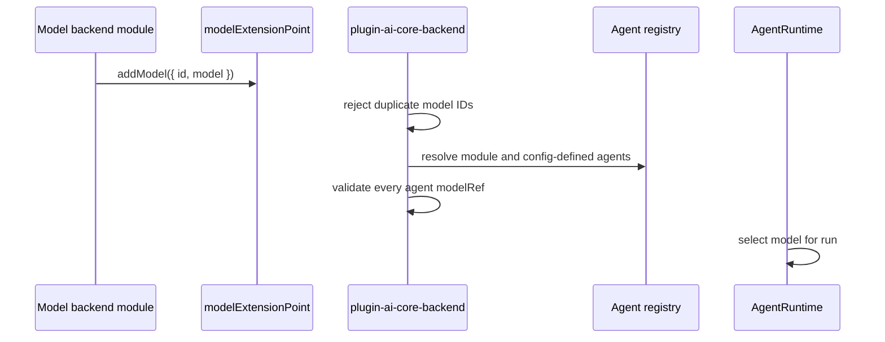

## LLM Providers

{: .no_toc }

LLM provider modules register executable LangChain language models with the AI Core backend. Agents reference those models by stable IDs through `modelRef`, and orchestrators receive the resolved model in `RunContext` without depending on a specific vendor SDK.

Embeddings providers are documented separately because they do not necessarily provide generation models. In the current stack, OpenRouter is the model provider module, while AWS Bedrock and OpenAI modules provide embeddings-backed retrieval tools.

### Model Contract

The shared contract is `ModelDefinition` from `plugin-ai-core-node`:

```typescript
type ModelDefinition = {
  id: string;
  model: BaseLLM | BaseChatModel;
};
```

The `id` is the value used by `ai.defaults.model`, `ai.agents.*.model`, `AgentDefinition.modelRef`, and crew role `modelRef` overrides. Keep IDs stable and descriptive. Prefer IDs that describe the deployment role, such as `openrouter-default` or `reviewer-fast`, over raw provider names when the underlying model may change.

### Registration Flow



The core backend fails startup if no model is registered. It also fails startup when `ai.defaults.model`, an agent `modelRef`, or a crew role `modelRef` points to an unknown model ID.

### OpenRouter Module

`@webstackbuilders/plugin-ai-core-backend-module-openrouter` registers one or more LangChain `ChatOpenRouter` instances through `modelExtensionPoint`.

Example config:

```yaml
ai:
  defaults:
    model: openrouter-default
  models:
    openrouter:
      models:
        - id: openrouter-default
          model: openai/gpt-4o-mini
          temperature: 0.2
          maxTokens: 4096
        - id: reviewer
          model: anthropic/claude-3.5-sonnet
          temperature: 0.1
```

The module also supports a single-model form:

```yaml
ai:
  models:
    openrouter:
      id: openrouter-default
      model: openai/gpt-4o-mini
```

If `apiKey` is omitted, `ChatOpenRouter` falls back to its normal `OPENROUTER_API_KEY` environment behavior. Optional fields include `baseURL`, `temperature`, `maxTokens`, `topP`, `siteUrl`, and `siteName`. `maxTokens` must be greater than zero when supplied, and `model` is required.

### Provider Modules vs Embeddings Modules

Do not assume a provider module registers both a chat model and embeddings. In this repo:

| Package                                    | Registers models | Registers retrieval/indexing tool | Notes                                                  |
| ------------------------------------------ | ---------------- | --------------------------------- | ------------------------------------------------------ |
| `plugin-ai-core-backend-module-openrouter` | Yes              | No                                | Uses `ChatOpenRouter`; pair with an embeddings module. |
| `plugin-ai-core-backend-module-openai`     | No               | Yes                               | Uses OpenAI embeddings and pgvector retrieval.         |
| `plugin-ai-core-backend-module-aws`        | No               | Yes                               | Uses AWS Bedrock embeddings and pgvector retrieval.    |

This split lets teams combine one model provider with a different embeddings provider. For example, an OpenRouter chat model can answer with context retrieved from OpenAI or Bedrock embeddings.

### LlmService Responsibilities

`LlmService` is the runtime adapter between orchestrators and LangChain models. It applies configured prompt templates, combines retrieved context with the user query, normalizes streaming output, and exposes a provider-neutral query method to orchestrators.

Provider modules should not duplicate prompt assembly or orchestration control. They should return configured model instances and let `LlmService` handle prompt and stream behavior.

### Adding a Model Provider

Create a backend module when adding a new model provider. The module should:

1. Depend on `@webstackbuilders/plugin-ai-core-node`.
2. Use `createBackendModule({ pluginId: 'ai-core', moduleId: '<provider>-models' })`.
3. Declare `modelExtensionPoint` in `registerInit` dependencies.
4. Read provider config from `coreServices.rootConfig`.
5. Validate required fields before constructing SDK clients.
6. Create LangChain `BaseLLM` or `BaseChatModel` instances.
7. Register each instance with `models.addModel({ id, model })`.
8. Add unit tests for config validation, model IDs, and multi-model registration.

Avoid registering default agents from a model provider unless the provider truly owns a domain workflow. Most model modules should only contribute models.

### Agent Model Selection

The model used for a run is selected in this order:

1. The agent's `modelRef`.
2. For crew roles, a role-level `modelRef` override when present.
3. For config-defined agents without a model, `ai.defaults.model`.
4. If no default model is configured, the first registered model.

The final selected model is passed to the orchestrator through `RunContext.model`. Orchestrators should not look up models directly except where a workflow intentionally selects alternate crew role models from the runtime-provided model registry.

### Change Checklist

When changing model provider behavior:

- Keep model IDs stable or document migration steps for `modelRef` users.
- Validate provider config before registering models.
- Add tests for missing required provider fields and invalid numeric options.
- Confirm the provider returns a LangChain-compatible `BaseLLM` or `BaseChatModel`.
- Update [Orchestrators & Agents](orchestrators.md) if model selection rules change.
- Update [Embeddings & Vector Stores](embeddings-vectorstores.md) only if the provider also adds embeddings.
