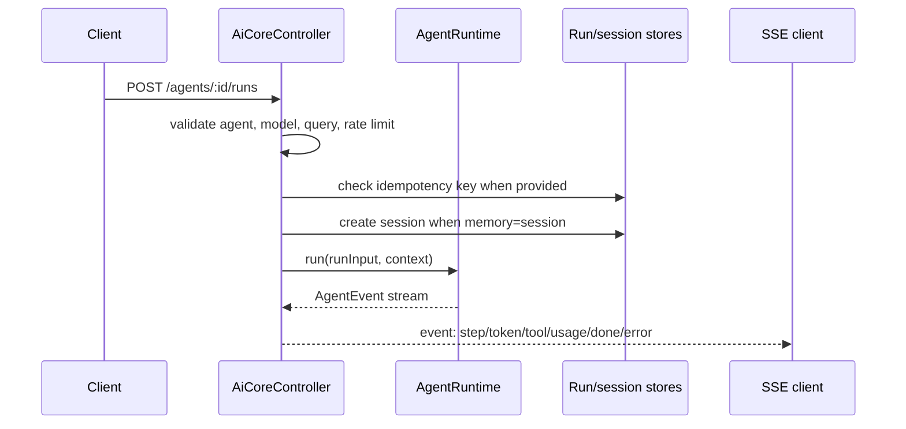

## Runtime API & Operations

{: .no_toc }

The runtime API is the operational control plane for AI Core. It bridges HTTP callers, trigger sources, approval decisions, run replay, embedding maintenance, and structured server-sent events into the `AgentRuntime` and persistence stores.

### Route Surface

Routes are bound by `plugin-ai-core-backend` through `bindRoutes` and handled by `AiCoreController`.

| Route                 | Method   | Purpose                                                                                                        |
| --------------------- | -------- | -------------------------------------------------------------------------------------------------------------- |
| `/embeddings/:source` | `POST`   | Create or refresh embeddings for a registered source and optional entity filter.                               |
| `/embeddings/:source` | `DELETE` | Delete embeddings for a registered source and optional entity filter.                                          |
| `/embeddings/:source` | `GET`    | Retrieve augmentation context directly for diagnostics or maintenance. Requires a non-empty `query` parameter. |
| `/agents`             | `GET`    | List registered agents and their runtime capabilities.                                                         |
| `/agents/:id/runs`    | `POST`   | Start an agent run and stream structured SSE events.                                                           |
| `/runs/:id/events`    | `GET`    | Replay persisted run events from a run, using `Last-Event-ID` for reconnect checkpoints.                       |
| `/runs/:id/approvals` | `POST`   | Submit an approval or rejection decision and stream resumed run events.                                        |
| `/triggers/:source`   | `POST`   | Start a run from a registered trigger source. Requires an `idempotencyKey`.                                    |
| `/webhooks/:provider` | `POST`   | Normalize provider webhook input into trigger execution shape.                                                 |

The source validator accepts any source registered in `SourceRegistry`, plus the special `all` source. Unknown sources fail with `422` so indexing and retrieval requests cannot silently target unsupported domains.

### Run Start Flow



The request body can pass the run input either as `input` or as the root body. The normalized input requires `query`, defaults `source` to `all`, and may include `sessionId`, `entityFilter`, and `idempotencyKey`.

### Structured SSE Events

The controller writes each runtime event as a standard SSE frame:

```text
event: token
data: {"runId":"...","text":"..."}
```

Replayable stored events include an `id:` line containing the persisted run-step sequence. Reconnecting clients should send `Last-Event-ID`; the controller parses that value and replays only later steps from `RunStore.listRunSteps`.

Supported event types are:

- `step`
- `token`
- `tool_call`
- `tool_result`
- `usage`
- `approval_request`
- `artifact`
- `done`
- `error`

Keep event payloads JSON-serializable. Large provider responses should be summarized for the stream and persisted as artifacts when the full data needs to survive.

### Approvals and Resume

Approval decisions are posted to `/runs/:id/approvals` with a body shaped like:

```json
{
  "status": "approved",
  "note": "Looks safe to apply",
  "decidedBy": "user:default/alex"
}
```

The controller validates the decision, loads the run and agent, resolves the model, then delegates to `AgentRuntime.resume`. The runtime records approval state through `RunStore`, logs approved write actions through `AuditLogSink`, and calls the selected orchestrator only if that orchestrator supports resume.

### Trigger and Webhook Runs

Trigger execution exists for event, schedule, and webhook-like workflows. `/triggers/:source` resolves the trigger binding by source or ID, then selects an agent in this order:

1. Explicit `agentId` in the request body.
2. The trigger binding's `agentId`.
3. The trigger binding's own `id`.
4. The configured default agent.

Trigger requests must include an `idempotencyKey`. If a run already exists for that key, the controller returns the existing run ID and status instead of starting another run. Webhook routes copy `x-idempotency-key` into the normalized trigger body when present and label the trigger as `webhook:<provider>`.

### Runtime Hardening

The `ai.hardening` config object controls operational limits at the controller/runtime boundary:

```yaml
ai:
  hardening:
    timeoutMs: 60000
    maxRetries: 1
    retryBackoffMs: 250
    maxTotalTokens: 20000
    rateLimitPerMinute: 30
```

| Key                  | Enforced by        | Behavior                                                         |
| -------------------- | ------------------ | ---------------------------------------------------------------- |
| `timeoutMs`          | `AiCoreController` | Aborts the run signal after the configured duration.             |
| `maxRetries`         | `AgentRuntime`     | Retries orchestration failures before emitting a terminal error. |
| `retryBackoffMs`     | `AgentRuntime`     | Base delay used for exponential retry backoff.                   |
| `maxTotalTokens`     | `AgentRuntime`     | Stops a run after usage events exceed the configured budget.     |
| `rateLimitPerMinute` | `AiCoreController` | Applies an in-memory per-agent rolling one-minute request limit. |

Client disconnects also abort the run signal. Tool and provider implementations should observe `ctx.signal` or the supplied run context signal where possible.

### Built-In Tool Packs

`plugin-ai-core-backend` currently registers lightweight built-in tool-pack stubs when no module has already registered the same IDs:

| Tool ID                                | Effect  | Current role                                |
| -------------------------------------- | ------- | ------------------------------------------- |
| `toolpack.github.search_issues`        | `read`  | Placeholder GitHub issue search context.    |
| `toolpack.github.create_issue`         | `write` | Placeholder GitHub issue creation result.   |
| `toolpack.jira.search_tickets`         | `read`  | Placeholder Jira ticket search context.     |
| `toolpack.slack.post_message`          | `write` | Placeholder Slack message posting result.   |
| `toolpack.pagerduty.active_incidents`  | `read`  | Placeholder PagerDuty incident lookup.      |
| `toolpack.kubernetes.get_workloads`    | `read`  | Placeholder Kubernetes workload inspection. |
| `toolpack.scaffolder.create_component` | `write` | Placeholder Backstage Scaffolder action.    |
| `toolpack.cost.estimate`               | `read`  | Placeholder cost impact estimate.           |

These are stable scaffolding hooks, not full provider implementations. Replace them with provider-backed modules when a workflow needs real external actions, auth propagation, schemas, retries, or approval-specific side effects.

### Change Checklist

When changing the runtime API or operational behavior:

- Add route/controller tests for validation, status codes, and SSE frames.
- Preserve `Last-Event-ID` replay behavior when changing stored event payloads.
- Require idempotency keys for trigger and webhook paths that can cause external side effects.
- Keep hardening controls close to the controller/runtime boundary so provider modules stay focused.
- Update [Orchestrators & Agents](orchestrators.md) if event semantics or resume behavior change.
- Update [Ingestion Pipelines](ingestion-pipelines.md) if embedding route behavior changes.
