# Graphs

## LangGraph Orchestrator

```mermaid
graph TD
    %% Base Styling Definitions
    classDef init fill:#2563EB,stroke:#1D4ED8,color:#FFFFFF,font-weight:bold;
    classDef process fill:#F3F4F6,stroke:#D1D5DB,color:#1F2937;
    classDef stream fill:#FEF3C7,stroke:#F59E0B,color:#78350F;
    classDef yield fill:#DCFCE7,stroke:#16A34A,color:#14532D;
    classDef error fill:#FEE2E2,stroke:#DC2626,color:#7F1D1D;
    classDef interrupt fill:#F3E8FF,stroke:#7C3AED,color:#4C1D95;

    %% Main Subgraph: run() API Engine Loop
    subgraph ExecutionLoop ["Primary Execution Loop: run()"]
        StartRun([Incoming runInput Request]) --> InitEngine[Reset sequence to 0]
        InitEngine --> YieldEnter["Emit Event: Step ('langgraph', 'enter')"]
        
        %% Phase 1: Conversation Context Memory
        YieldEnter --> LoadHistory["Phase 1: loadHistoryContext()"]
        LoadHistory --> EmitMemEnter["Emit Event: Step ('memory.load', 'enter')"]
        EmitMemEnter --> FetchMessages[Fetch history limits from sessionStore]
        FetchMessages --> EmitMemExit["Emit Event: Step ('memory.load', 'exit')"]
        
        %% Phase 2: RAG Pipeline Engine
        EmitMemExit --> RAGPipeline{"Phase 2: executeRetrievalPipeline()"}
        RAGPipeline -- "Tool Found" --> InvokeRetrieval["Invoke 'knowledge.retrieve' Tool"]
        RAGPipeline -- "Tool Missing / Exception" --> PipeError[Log Error Trace]
        InvokeRetrieval --> CheckOutput{"Is Output Array?"}
        
        CheckOutput -- "Yes" --> CombineQuery[Compose Query String with Context Elements]
        CheckOutput -- "No" --> EmptyEmbeddings[Fall back to empty array Docs] --> CombineQuery
        PipeError --> YieldCoreErr["Emit Event: 'error'"] --> TerminateRun([Terminate Execution Stream])
        
        %% Phase 3: Streaming Iteration Engine
        CombineQuery --> QueryLLM["Phase 3: Invoke llmService.query() Stream"]
        QueryLLM --> StreamLoop{"Iterate Engine Loop Chunks"}
        
        StreamLoop -- "Chunk Available" --> MetricAccum["accumulateMetrics() for input/output/total"]
        MetricAccum --> ExtractText["extractChunkText() string extraction"]
        ExtractText --> TextCheck{"Is Text Valid?"}
        TextCheck -- "Yes" --> AppendResponse[Accumulate Response Buffer]
        AppendResponse --> YieldToken["Emit Event: 'token'"] --> StreamLoop
        TextCheck -- "No" --> StreamLoop
        
        %% Phase 4: Persistence & Gate Checkpoints
        StreamLoop -- "Stream Depleted" --> PersistHistory["Phase 4: persistSessionHistory()"]
        PersistHistory --> EmitPersistEnter["Emit Event: Step ('memory.persist', 'enter')"]
        EmitPersistEnter --> SaveMessages[Append Message Arrays to sessionStore]
        SaveMessages --> EmitPersistExit["Emit Event: Step ('memory.persist', 'exit')"]
        
        EmitPersistExit --> SaveCheckpoint["saveLifecycleCheckpoint() inside checkpointStore"]
        SaveCheckpoint --> GuardCondition{"requiresApprovalGuard() Requirements Met?"}
        
        %% Phase 4b: Interrupt Gateway Block
        GuardCondition -- "Yes (Write Tool Context Matches)" --> HandleInterrupt["handleApprovalInterrupt()"]
        HandleInterrupt --> UpdateStatePending[Save checkpoint status 'awaiting_approval']
        UpdateStatePending --> YieldApproval["Emit Event: 'approval_request' (Interrupt triggered)"]
        YieldApproval --> TerminateRun
        
        %% Phase 5: Normal finalization
        GuardCondition -- "No" --> YieldMetrics["Phase 5: Emit Event: 'usage' (metrics metadata)"]
        YieldMetrics --> YieldExit["Emit Event: Step ('langgraph', 'exit')"]
        YieldExit --> YieldDone["Emit Event: 'done'"] --> TerminateRun
    end

    %% Secondary Entrypoint: resume() Core Block
    subgraph ApprovalResume ["State Recovery Pipeline: resume()"]
        %% FIXED LINE: Wrapped quotes around parenthesized string inside node
        StartResume(["Incoming resume() Action Event"]) --> LoadRunCheck[Query runId check from checkpointStore]
        LoadRunCheck --> CheckpointFound{"Does Checkpoint Exist?"}
        
        CheckpointFound -- "No" --> ResumeMissingErr["Log Warning & Emit Event: 'error'"] --> TerminateResume([Close Resume Operation])
        CheckpointFound -- "Yes" --> EvaluateDecision{"Evaluate Decision Status"}
        
        EvaluateDecision -- "rejected" --> ResumeRejectErr["Log warning & Emit Event: 'error'"] --> TerminateResume
        EvaluateDecision -- "approved" --> YieldResumeStep["Emit Event: Step ('approval.resume', 'enter')"]
        
        YieldResumeStep --> MapArtifact[Extract original proposedArtifact meta details]
        MapArtifact --> YieldArtifact["Emit Event: 'artifact' containing action payload info"]
        YieldArtifact --> UpdateCheckpointDone[Save checkpoint status 'done' with resumedAt timestamp]
        UpdateCheckpointDone --> TerminateResume
    end

    %% Class Parameter Configuration Assignments
    class StartRun,StartResume init;
    class InitEngine,FetchMessages,InvokeRetrieval,CheckOutput,CombineQuery,QueryLLM,MetricAccum,ExtractText,TextCheck,AppendResponse,SaveMessages,SaveCheckpoint,GuardCondition,LoadRunCheck,CheckpointFound,EvaluateDecision,MapArtifact,UpdateCheckpointDone,UpdateStatePending,EmptyEmbeddings,PipeError process;
    class StreamLoop stream;
    class YieldEnter,EmitMemEnter,EmitMemExit,EmitPersistEnter,EmitPersistExit,YieldToken,YieldMetrics,YieldExit,YieldDone,YieldResumeStep,YieldArtifact yield;
    class YieldCoreErr,ResumeMissingErr,ResumeRejectErr,YieldCoreErr error;
    class HandleInterrupt,YieldApproval interrupt;
```

A professional, ultra-clean software architecture flowchart diagram detailing an AI Orchestrator workflow layout, designed for an enterprise tech presentation.

The background is a clean, solid, minimalist light-gray grid. The diagram flows clearly from top to bottom, using clean straight connecting lines with subtle arrowheads to demonstrate logical process flow.

The flowchart features four distinct functional types of blocks, each with a rounded rectangle shape, clean typography, and a modern color palette:

1. Start/End Entry nodes are styled in sharp Cobalt Blue with white text.
2. Standard Process/Validation steps are styled in Minimalist Light-Gray with dark text.
3. Stream Loops are highlighted in Soft Pastel Amber with dark text.
4. Human-In-The-Loop Interrupt/Approval gates are styled in soft Pastel Purple with dark text.

The flowchart branches into two distinct execution tracks clearly separated by clean empty space:

- The left track is titled "Primary run() Workflow Loop" and visualizes steps for initialization, loading memory history context, executing a retrieval RAG pipeline tool, running an iterative LLM stream loop yielding text tokens, persisting history, and executing an approval safety gate check.
- The right track is titled "State Recovery Pipeline: resume()" and outlines steps for loading run status check keys, evaluating human approval decisions, emitting approval resume tokens, mapping asset artifact schemas, and finalizing status properties.

The entire graphic has an elegant, high-utility, professional aesthetic with pixel-perfect alignment, no clutter, clear margins, and crisp text rendering. Graphic design, vector illustration, high resolution.